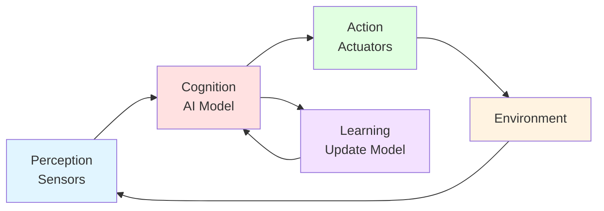

# Introduction to Physical AI

## Learning Objectives

By the end of this chapter, you will be able to:

- **Understand** the fundamental differences between digital AI and Physical AI
- **Identify** the key sensor types used in humanoid robotics (LIDAR, cameras, IMUs, force/torque sensors)
- **Explain** the perception-action-learning loop in embodied intelligence
- **Analyze** the current state and challenges of the humanoid robotics landscape
- **Apply** basic sensor data processing techniques using Python

## What is Physical AI?

### From Digital AI to Embodied Intelligence

Physical AI represents a paradigm shift from traditional artificial intelligence systems that operate purely in the digital realm to AI that interacts directly with the physical world. While digital AI excels at tasks like image classification, natural language processing, and game playing, Physical AI must navigate the complexities of real-world environments through sensors and actuators.

The core distinction lies in **embodiment**—Physical AI systems have physical form and must obey the laws of physics. They cannot simply process data; they must perceive their environment, make decisions in real-time, and execute physical actions that affect the world around them. This creates unique challenges: sensor noise, uncertainty, real-time constraints, and safety considerations that digital AI rarely encounters.

Consider the difference between a vision AI that classifies images of cats versus a robotic system that must navigate to a cat, pick it up gently, and carry it to another location. The latter requires:
- Real-time sensor processing (vision, depth, force)
- Understanding of 3D geometry and physics
- Motor control and manipulation
- Continuous feedback and adaptation
- Safety awareness (don't harm the cat!)

Physical AI is the technology enabling robots to understand and interact with the physical world in intelligent, adaptive ways. It combines perception, cognition, and action into systems that can operate autonomously in human environments.

### Physical AI vs. Traditional AI

The table below highlights the key differences between digital AI and Physical AI:

| Aspect | Digital AI | Physical AI |
|--------|-----------|-------------|
| **Environment** | Simulated, digital data | Physical world, real-time |
| **Feedback** | Delayed, batch processing | Immediate, continuous |
| **Safety** | Minimal (errors are recoverable) | Critical (physical consequences) |
| **Uncertainty** | Controlled datasets | Sensor noise, unpredictable dynamics |
| **Constraints** | Computational limits | Physics laws, real-time deadlines |
| **Evaluation** | Accuracy metrics | Task success + safety |
| **Embodiment** | None (pure software) | Sensors + Actuators |

Physical AI must deal with challenges that don't exist in digital AI:
- **Physics constraints**: Gravity, friction, momentum, and other physical forces
- **Real-time requirements**: Decisions must be made in milliseconds, not minutes
- **Sensor limitations**: Noisy, incomplete, and sometimes contradictory information
- **Safety-critical operation**: Errors can cause physical harm or damage
- **Sim-to-real gap**: Models trained in simulation must transfer to reality

## Foundations of Embodied Intelligence

### Perception, Action, and Learning Loop

Embodied intelligence is fundamentally about the continuous cycle of perceiving the environment, making decisions, taking actions, and learning from the outcomes. This **perception-action-learning loop** is the cornerstone of Physical AI systems.



Let's break down each component:

**1. Perception**: The robot gathers information about its environment through sensors. This includes:
- **Vision**: Cameras provide color images, depth cameras add 3D information
- **Proprioception**: Joint encoders tell the robot where its limbs are
- **Exteroception**: LIDAR, ultrasonic sensors detect external objects
- **Force/Touch**: Contact sensors detect interaction with objects

**2. Cognition**: The AI model processes sensor data and makes decisions. This could involve:
- Object detection and recognition
- Path planning and navigation
- Manipulation planning (how to grasp an object)
- High-level task planning (sequence of actions)

**3. Action**: Actuators execute the decided commands:
- **Motors**: Move joints to specific positions
- **Servos**: Provide precise control with feedback
- **End-effectors**: Grippers, hands, or tools interact with objects

**4. Environment**: The physical world responds to the robot's actions according to physics laws. The environment includes:
- Static objects (walls, furniture)
- Dynamic objects (people, moving obstacles)
- Terrain variations (flat, stairs, uneven ground)

**5. Learning**: The robot updates its model based on the outcomes. This enables:
- **Improvement**: Better performance over time
- **Adaptation**: Adjusting to new environments or tasks
- **Generalization**: Applying learned skills to novel situations

This loop operates continuously, often at frequencies of 10-1000 Hz depending on the task. The faster the loop, the more responsive the robot can be to changes in the environment.

### The Role of Physics in AI Systems

Unlike digital AI, Physical AI must respect the laws of physics at every step. This creates both challenges and opportunities:

**Physics as Constraint**: The robot cannot teleport, cannot instantly change direction, and cannot violate momentum conservation. Controllers must account for:
- Inertia and mass distribution
- Gravity's constant pull
- Friction between surfaces
- Joint limits and mechanical constraints

**Physics as Tool**: Understanding physics enables better prediction and planning:
- Forward simulation predicts future states
- Inverse dynamics calculates required torques
- Physics engines enable safe testing in simulation

**Sim-to-Real Transfer**: Training robots in simulation is faster and safer than real-world training, but the "reality gap" must be bridged:
- **Domain randomization**: Vary physics parameters during training
- **System identification**: Measure real robot properties precisely
- **Residual learning**: Learn corrections to simulation models

The integration of physics into AI systems is what makes Physical AI distinct and challenging. Success requires both AI expertise and deep understanding of robotics, control theory, and mechanical engineering.

## Overview of Humanoid Robotics Landscape

### Current State of Humanoid Robots

Humanoid robotics has made remarkable progress in recent years (2024-2025), with several platforms demonstrating impressive capabilities:

**Commercial Humanoid Robots**:
- **Boston Dynamics Atlas**: Athletic bipedal robot capable of running, jumping, and performing parkour maneuvers with exceptional dynamic balance
- **Tesla Optimus (Bot)**: Designed for mass production to assist with repetitive tasks in factories and homes
- **Figure 01**: General-purpose humanoid aimed at commercial deployment in warehouses and manufacturing
- **Agility Robotics Digit**: Bipedal robot already deployed in logistics environments for box moving

**Research Platforms**:
- **NAO**: Small humanoid platform widely used in education and research, capable of walking, object manipulation, and human interaction
- **Pepper**: Social robot designed for customer interaction and service roles
- **ASIMO** (legacy): Honda's humanoid that pioneered many bipedal locomotion techniques, now retired

**Key Capabilities** demonstrated by modern humanoid robots:
- **Stable bipedal walking**: On flat ground and modest inclines
- **Dynamic balance**: Recovering from pushes and disturbances
- **Object manipulation**: Picking, placing, and tool use with robotic hands
- **Human interaction**: Speech recognition, conversation, and gesture-based communication
- **Autonomous navigation**: SLAM-based mapping and path planning in indoor environments

Recent advances include improved AI integration, more natural motion generation, and better adaptation to unstructured environments. However, humanoids still face significant limitations compared to humans.

### Key Challenges and Opportunities

Despite progress, several fundamental challenges remain:

**1. Balance and Locomotion on Uneven Terrain**
- Walking on stairs, slopes, and rough terrain requires sophisticated balance control
- Zero-Moment Point (ZMP) stability criterion must be maintained
- Current robots struggle with unexpected disturbances and slippery surfaces
- Energy efficiency is far below human-level performance

**2. Dexterous Manipulation with Compliant Hands**
- Most robot hands have fewer degrees of freedom than human hands (typically 1-3 DOF vs. 20+ for humans)
- Force control is critical but challenging without rich tactile sensing
- Grasping deformable or fragile objects requires delicate force modulation
- Tool use remains difficult due to limited dexterity

**3. Natural Human-Robot Interaction**
- Speech recognition in noisy environments is improving but not perfect
- Understanding context and intent from natural language is challenging
- Generating appropriate gestures and expressive motion is an active research area
- Social navigation (moving among people politely) requires cultural awareness

**4. Power Efficiency and Battery Life**
- Current humanoid robots typically run for 1-2 hours on battery
- High power consumption from actuators limits operational time
- Trade-off between capability (stronger motors) and efficiency

**5. Cost Reduction for Mass Deployment**
- Research platforms cost $50,000-$500,000+
- Commercial viability requires costs closer to $10,000-$30,000
- Manufacturing at scale could reduce costs significantly

**Opportunities** in humanoid robotics:
- **AI advancement**: Language models, vision transformers, and RL are enabling smarter robots
- **Human-centric environments**: Humanoid form factor fits existing infrastructure (stairs, doors, tools)
- **Aging populations**: Growing need for assistance robots in homes and healthcare
- **Dangerous tasks**: Humanoids can work in hazardous environments (disaster response, nuclear facilities)

## Sensor Systems for Physical AI

Humanoid robots rely on a suite of sensors to perceive their environment. Let's examine the key sensor types:

### LIDAR: Laser-based Depth Sensing

**LIDAR (Light Detection and Ranging)** uses laser pulses to measure distances to objects. It works by:
1. Emitting a laser pulse
2. Measuring the time it takes for the reflected pulse to return
3. Calculating distance: `distance = (time × speed_of_light) / 2`

**Types of LIDAR**:
- **2D LIDAR**: Scans a single plane (e.g., horizontal at ground level), providing a 2D slice of the environment
- **3D LIDAR**: Scans multiple planes or rotates to capture a 3D point cloud

**Applications in robotics**:
- **Mapping**: Build 2D/3D maps of the environment
- **Obstacle avoidance**: Detect objects in the robot's path
- **Localization**: SLAM (Simultaneous Localization and Mapping) uses LIDAR to determine robot position

**Advantages**: Long range (up to 100m+), accurate depth, works in various lighting conditions
**Limitations**: Expensive, struggles with reflective or transparent surfaces

### Cameras: Vision and RGB-D

**RGB Cameras** capture color images, providing rich visual information about the environment. Modern robotics often uses **RGB-D cameras** that combine color with depth information.

**Depth Camera Technologies**:
- **Stereo cameras**: Use two cameras (like human eyes) to triangulate depth
- **Structured light**: Project a known pattern and analyze distortion
- **Time-of-Flight (ToF)**: Measure time for infrared light to return (similar to LIDAR principle)

**Applications**:
- **Object recognition**: Identify objects using computer vision (CNNs, vision transformers)
- **Scene understanding**: Semantic segmentation labels each pixel
- **3D pose estimation**: Determine object position and orientation
- **Human detection**: Track people for safe interaction

**Advantages**: Rich visual information, relatively inexpensive, compact
**Limitations**: Affected by lighting conditions, depth cameras have limited range (typically 0.5-10m)

### IMUs: Inertial Measurement Units

An **IMU (Inertial Measurement Unit)** combines accelerometers and gyroscopes to measure:
- **Linear acceleration** (3 axes: x, y, z)
- **Angular velocity** (3 axes: roll, pitch, yaw)

**How IMUs work**:
- **Accelerometers**: Detect changes in velocity along each axis (includes gravity)
- **Gyroscopes**: Detect rotational velocity around each axis

**Applications in humanoid robotics**:
- **Orientation estimation**: Know which way is "up" (critical for balance)
- **Balance control**: Detect tilting and adjust posture
- **Motion tracking**: Monitor robot movement and detect falls
- **Sensor fusion**: Combine with other sensors for better state estimation

**Advantages**: Fast update rate (100-1000 Hz), compact, inexpensive
**Limitations**: Drift over time (integration errors), sensitive to vibration

Here's an example of IMU data structure and basic processing:

```python
import numpy as np

# IMU data structure: [accel_x, accel_y, accel_z, gyro_x, gyro_y, gyro_z]
# Units: acceleration in m/s², angular velocity in rad/s
imu_data = np.array([0.1, 0.2, 9.8, 0.01, -0.02, 0.0])

# Extract accelerometer readings (m/s²)
acceleration = imu_data[:3]

# Extract gyroscope readings (rad/s)
angular_velocity = imu_data[3:]

# Calculate magnitude of acceleration
# This is useful for detecting if the robot is falling or has collided
accel_magnitude = np.linalg.norm(acceleration)

# When stationary, acceleration magnitude should be close to 9.8 m/s² (gravity)
print(f"Acceleration magnitude: {accel_magnitude:.2f} m/s²")
print(f"Angular velocity: {angular_velocity}")

# Simple tilt detection
# If the robot is perfectly upright, accel_z ≈ 9.8 and accel_x, accel_y ≈ 0
tilt_x = np.arctan2(acceleration[0], acceleration[2]) * 180 / np.pi
tilt_y = np.arctan2(acceleration[1], acceleration[2]) * 180 / np.pi

print(f"Tilt angle X: {tilt_x:.2f}°")
print(f"Tilt angle Y: {tilt_y:.2f}°")
```

**Key points**:
- IMU sensors provide both linear acceleration and angular velocity
- Accelerometer data can be used to estimate orientation relative to gravity
- Gyroscope data tracks rotational movement
- Sensor fusion algorithms (e.g., Kalman filter) combine IMU with other sensors for better accuracy

### Force/Torque Sensors

**Force/torque sensors** measure the forces and moments applied at contact points, typically placed in:
- **Wrists**: Measure forces during manipulation
- **Feet**: Detect ground reaction forces for balance
- **Fingers**: Enable gentle grasping and tactile feedback

**How they work**:
- **Strain gauges**: Detect deformation in the sensor structure
- **Piezoelectric sensors**: Generate voltage proportional to applied force

**Applications**:
- **Grasping control**: Apply just enough force to hold objects without crushing them
- **Collision detection**: Detect unexpected contact and stop motion for safety
- **Safe human interaction**: Limit forces during physical contact
- **Terrain adaptation**: Adjust foot placement based on ground firmness

**Force control example**: When grasping a fragile object like an egg, the robot must:
1. Close gripper until initial contact detected (force threshold)
2. Apply small additional force to secure grip
3. Monitor force continuously to prevent crushing
4. Adjust grip force if object starts to slip (increase) or deform (decrease)

## Perception-Action Loop Example

To illustrate how these sensors work together, here's a simplified perception-action loop for a humanoid robot:

```python
import time

class SimpleRobot:
    """
    Simplified robot class demonstrating perception-action loop
    """
    def __init__(self):
        self.position = [0.0, 0.0]  # (x, y) position
        self.orientation = 0.0       # heading angle
        self.sensors = {
            'lidar': None,
            'camera': None,
            'imu': None,
            'force': None
        }

    def perceive(self):
        """
        Perception: Read all sensors
        In a real robot, this would interface with hardware
        """
        # Simulated sensor readings
        self.sensors['lidar'] = self.read_lidar()
        self.sensors['camera'] = self.read_camera()
        self.sensors['imu'] = self.read_imu()
        self.sensors['force'] = self.read_force_sensors()

        return self.sensors

    def decide(self, sensor_data):
        """
        Cognition: Process sensor data and make decision
        This is where AI/ML models would run
        """
        # Simple decision logic
        if sensor_data['lidar']['min_distance'] < 0.5:  # Obstacle within 0.5m
            action = {'type': 'stop'}
        else:
            action = {'type': 'move_forward', 'speed': 0.3}

        return action

    def act(self, action):
        """
        Action: Execute the decided command
        In a real robot, this would send commands to motors
        """
        if action['type'] == 'move_forward':
            # Update position (simplified kinematics)
            self.position[0] += action['speed'] * 0.1  # time step = 0.1s
            print(f"Moving forward at {action['speed']} m/s")
        elif action['type'] == 'stop':
            print("Stopping - obstacle detected")

    def run_control_loop(self, iterations=10):
        """
        Main perception-action loop
        Runs at 10 Hz (every 0.1 seconds)
        """
        for i in range(iterations):
            # Perceive → Decide → Act
            sensor_data = self.perceive()
            action = self.decide(sensor_data)
            self.act(action)

            # Simulate time delay (100ms control loop)
            time.sleep(0.1)

    # Simulated sensor methods (would interface with real hardware)
    def read_lidar(self):
        return {'min_distance': 1.0, 'points': []}

    def read_camera(self):
        return {'image': None, 'detected_objects': []}

    def read_imu(self):
        return {'accel': [0, 0, 9.8], 'gyro': [0, 0, 0]}

    def read_force_sensors(self):
        return {'left_foot': 0, 'right_foot': 0}

# Example usage
if __name__ == "__main__":
    robot = SimpleRobot()
    robot.run_control_loop(iterations=5)
```

**Key points**:
- The perception-action loop runs continuously at a fixed frequency (10 Hz in this example)
- Real robots run this loop much faster (50-1000 Hz depending on the task)
- Each iteration: perceive current state → decide what to do → execute action
- Sensors provide the robot's "senses" of the world
- AI models process sensor data to make intelligent decisions

## Sensor Data Processing Example

Here's a more realistic example of processing sensor data with noise filtering:

```python
import numpy as np
from collections import deque

class SensorProcessor:
    """
    Process noisy sensor data with filtering
    """
    def __init__(self, window_size=5):
        self.window_size = window_size
        self.data_buffer = deque(maxlen=window_size)

    def moving_average_filter(self, new_value):
        """
        Simple moving average filter to reduce sensor noise
        """
        self.data_buffer.append(new_value)
        return np.mean(self.data_buffer)

    def process_imu_stream(self, imu_readings):
        """
        Process a stream of IMU readings
        imu_readings: list of [accel_x, accel_y, accel_z, gyro_x, gyro_y, gyro_z]
        """
        filtered_data = []

        for reading in imu_readings:
            # Apply moving average to each axis
            filtered_reading = self.moving_average_filter(reading)
            filtered_data.append(filtered_reading)

        return filtered_data

# Example: Simulated noisy IMU data
np.random.seed(42)
num_samples = 20

# True acceleration is 9.8 m/s² in z-axis (gravity)
# But sensor readings have noise
true_accel_z = 9.8
noisy_readings = true_accel_z + np.random.normal(0, 0.3, num_samples)

# Process with filter
processor = SensorProcessor(window_size=5)
filtered_readings = []

for i, noisy_value in enumerate(noisy_readings):
    filtered_value = processor.moving_average_filter(noisy_value)
    filtered_readings.append(filtered_value)

    if i < 5:  # Show first few samples
        print(f"Sample {i}: Noisy={noisy_value:.2f}, Filtered={filtered_value:.2f}")

print(f"\nNoise reduction:")
print(f"  Noisy std dev: {np.std(noisy_readings):.3f}")
print(f"  Filtered std dev: {np.std(filtered_readings[5:]):.3f}")  # After filter stabilizes
```

**Key points**:
- Real sensor data is always noisy due to electronic noise, vibrations, and environmental factors
- Filtering is essential for reliable perception
- Moving average is a simple but effective filter for many applications
- More sophisticated filters (Kalman, particle filters) are used in practice

## Summary

In this chapter, we explored the fundamental concepts of Physical AI and embodied intelligence. We examined how Physical AI differs from traditional digital AI through its integration with physical sensors and actuators, enabling robots to perceive and act in the real world. We also surveyed the current landscape of humanoid robotics and the key sensor technologies that make Physical AI possible.

The perception-action-learning loop forms the foundation of embodied intelligence, where robots continuously sense their environment, make decisions, execute actions, and learn from outcomes. Understanding this loop is essential for all subsequent chapters, where we'll build complete robotic systems using ROS 2, simulation tools, and AI integration.

## Key Takeaways

- **Physical AI vs Digital AI**: Physical AI operates in the real world through sensors and actuators, facing challenges like sensor noise, real-time constraints, and safety requirements that digital AI doesn't encounter
- **Embodied Intelligence**: The perception-action-learning loop enables robots to continuously sense, decide, act, and learn from physical interaction with their environment
- **Humanoid Robotics Landscape**: Current robots demonstrate impressive capabilities (bipedal walking, manipulation, interaction) but face challenges in balance, dexterity, power efficiency, and cost
- **Sensor Suite**: LIDAR provides long-range depth sensing, cameras enable vision and object recognition, IMUs track orientation and motion, and force sensors enable safe interaction and manipulation
- **Sensor Fusion**: Combining multiple sensor modalities provides robust perception despite individual sensor limitations
- **Integration Challenge**: Successful Physical AI requires expertise in AI/ML, robotics, control theory, and mechanical engineering working together

## Further Reading

- **Physical AI Research**: Anthropic and other research organizations are advancing Physical AI capabilities
- **ROS 2 Documentation**: The next chapter introduces ROS 2, the robotic operating system - https://docs.ros.org/en/humble/
- **Humanoid Robotics Survey**: "Humanoid Robotics: A Reference" by Goswami & Vadakkepat provides comprehensive coverage
- **Boston Dynamics Atlas**: Technical papers on bipedal locomotion and dynamic maneuvers
- **Sensor Technologies**: Manufacturers like Velodyne (LIDAR), Intel RealSense (RGB-D cameras), and Bosch (IMUs) provide detailed documentation
