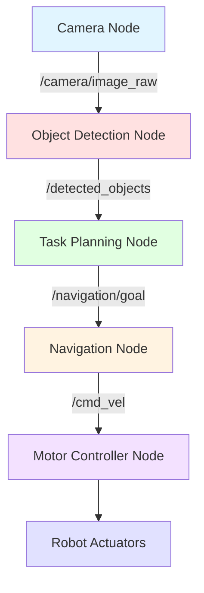

# The Robotic Nervous System (ROS 2)

## Learning Objectives

By the end of this chapter, you will be able to:

- **Understand** the architecture and core concepts of ROS 2 (nodes, topics, services, actions)
- **Explain** the key differences between ROS 1 and ROS 2 and why ROS 2 is preferred for new projects
- **Implement** basic ROS 2 nodes using Python and the rclpy library
- **Create** launch files for managing multiple ROS 2 nodes simultaneously
- **Describe** the URDF format for defining robot kinematics and physical properties
- **Apply** ROS 2 communication patterns to bridge Python AI agents with robot controllers

## Introduction to ROS 2

### What is ROS 2 and Why It Matters

**ROS 2 (Robot Operating System 2)** is not an operating system in the traditional sense—it's a middleware framework that provides the infrastructure for building complex robotic systems. Think of ROS 2 as the "nervous system" that connects sensors, actuators, decision-making algorithms, and user interfaces in a modular, scalable architecture.

ROS 2 provides:
- **Standardized communication**: Nodes communicate via topics, services, and actions using a publisher-subscriber model and request-response patterns
- **Modularity**: Complex robot systems are broken down into independent nodes, each performing a specific function (perception, planning, control, etc.)
- **Tooling**: Rich ecosystem of visualization tools (RViz), simulation (Gazebo), debugging, and logging utilities
- **Reusability**: Community-contributed packages for SLAM, navigation, manipulation, computer vision, and more

Why does ROS 2 matter for humanoid robotics? Humanoid robots are extraordinarily complex systems with dozens of sensors, hundreds of actuators, and multiple AI models running concurrently. ROS 2 provides the framework to orchestrate this complexity while maintaining real-time performance, reliability, and safety.

The ROS ecosystem has become the de facto standard in research and industry robotics. Understanding ROS 2 is essential for anyone working on Physical AI systems, from academic research to commercial deployment.

**Key Benefits**:
- **Real-time support**: ROS 2 is built on DDS (Data Distribution Service), enabling deterministic real-time communication critical for control loops
- **Cross-platform**: Works on Linux, Windows, and macOS (unlike ROS 1, which was Linux-only)
- **Security**: SROS2 (Secure ROS 2) provides authentication, encryption, and access control
- **Production-ready**: Designed for commercial deployment, not just research prototypes

### ROS 1 vs ROS 2: Key Differences

ROS 2 was designed from the ground up to address limitations of ROS 1 that hindered commercial deployment. Here's a comparison:

| Feature | ROS 1 | ROS 2 |
|---------|-------|-------|
| **Middleware** | Custom TCPROS/UDPROS | DDS (OMG standard) |
| **Real-time Support** | Limited (soft real-time at best) | Full real-time support (RTPS protocol) |
| **Platform Support** | Linux only | Linux, Windows, macOS |
| **Security** | None (or minimal SROS) | SROS2 with DDS Security |
| **Multi-robot** | Difficult (requires workarounds) | Native support via DDS domains |
| **Master Node** | Required (single point of failure) | No master (distributed architecture) |
| **Python Version** | Python 2.7 (EOL) | Python 3.x |
| **Lifecycle Management** | Manual | Managed node lifecycle states |
| **QoS (Quality of Service)** | None | Configurable (reliable, best-effort, etc.) |

**Why ROS 2 is Preferred for New Projects**:
1. **No single point of failure**: ROS 1 required a master node that managed all communication; if it failed, the entire system crashed. ROS 2 is decentralized.
2. **Real-time guarantees**: Critical for humanoid balance controllers, manipulation, and high-speed navigation.
3. **Security**: Commercial deployments require encrypted communication and access control.
4. **Long-term support**: ROS 1 Noetic (the final release) reached EOL in 2025; ROS 2 is actively developed with LTS releases.

**Migration from ROS 1**: While ROS 1 code cannot run directly in ROS 2, the `ros1_bridge` package allows ROS 1 and ROS 2 nodes to communicate, enabling gradual migration. However, for new humanoid robotics projects, starting with ROS 2 is strongly recommended.

## ROS 2 Architecture and Core Concepts

ROS 2 organizes computation into **nodes** that communicate via three primary patterns: **topics** (streaming data), **services** (request-response), and **actions** (long-running tasks). Let's explore each concept in depth.

### Nodes: The Building Blocks

A **node** in ROS 2 is an independent process that performs a specific computational task. Examples include:
- A camera driver node that publishes image data
- A SLAM (Simultaneous Localization and Mapping) node that builds a map
- A path planning node that computes navigation paths
- A motor controller node that sends commands to actuators

**Key Principles**:
- **Single responsibility**: Each node should have one clear purpose
- **Modularity**: Nodes can be developed, tested, and deployed independently
- **Composability**: Multiple nodes work together to achieve complex behaviors
- **Lifecycle management**: ROS 2 supports managed lifecycle states (unconfigured, inactive, active, finalized)

**Node Discovery**: In ROS 2, nodes discover each other automatically through DDS discovery protocols. No central master is required—when a publisher and subscriber with matching topic names exist, they connect automatically.



### Topics: Publisher-Subscriber Communication

**Topics** implement asynchronous, many-to-many communication. Nodes publish messages to topics, and other nodes subscribe to topics to receive messages.

**Characteristics**:
- **Asynchronous**: Publishers send messages without waiting for subscribers
- **Decoupled**: Publishers don't know who (if anyone) is listening
- **Many-to-many**: Multiple publishers and subscribers can share a topic
- **Typed**: Each topic has a message type (e.g., `sensor_msgs/Image`, `geometry_msgs/Twist`)

**Common Message Types**:
- `std_msgs/String`: Simple text messages
- `sensor_msgs/Image`: Camera images
- `sensor_msgs/LaserScan`: LIDAR data
- `geometry_msgs/Twist`: Velocity commands (linear + angular)
- `nav_msgs/Odometry`: Robot position and velocity

**Use Cases**: Topics are ideal for streaming sensor data, publishing status updates, and sending continuous control commands.

Here's a complete example of a ROS 2 publisher node:

```python
import rclpy
from rclpy.node import Node
from std_msgs.msg import String

class MinimalPublisher(Node):
    """
    Simple ROS 2 publisher that sends string messages at 1 Hz
    """
    def __init__(self):
        super().__init__('minimal_publisher')

        # Create publisher: topic name '/topic', message type String, queue size 10
        self.publisher_ = self.create_publisher(String, 'topic', 10)

        # Create timer: callback every 1.0 second
        self.timer = self.create_timer(1.0, self.timer_callback)
        self.count = 0

        self.get_logger().info('Minimal Publisher has started')

    def timer_callback(self):
        """
        Called every 1.0 seconds to publish a message
        """
        msg = String()
        msg.data = f'Hello, ROS 2! Count: {self.count}'

        # Publish the message
        self.publisher_.publish(msg)
        self.get_logger().info(f'Publishing: "{msg.data}"')

        self.count += 1

def main(args=None):
    # Initialize ROS 2
    rclpy.init(args=args)

    # Create and spin the node
    minimal_publisher = MinimalPublisher()

    try:
        rclpy.spin(minimal_publisher)  # Keep node running until interrupted
    except KeyboardInterrupt:
        pass

    # Cleanup
    minimal_publisher.destroy_node()
    rclpy.shutdown()

if __name__ == '__main__':
    main()
```

**Key points**:
- `rclpy.init()` initializes the ROS 2 client library
- `Node.__init__('node_name')` creates a node with a unique name
- `create_publisher(msg_type, topic_name, queue_size)` creates a publisher
- `create_timer(period, callback)` schedules periodic execution
- `rclpy.spin(node)` keeps the node running and processing callbacks
- `get_logger()` provides ROS 2 logging (info, warn, error, debug levels)

Now let's see the corresponding subscriber:

```python
import rclpy
from rclpy.node import Node
from std_msgs.msg import String

class MinimalSubscriber(Node):
    """
    Simple ROS 2 subscriber that listens to string messages
    """
    def __init__(self):
        super().__init__('minimal_subscriber')

        # Create subscription: topic name '/topic', message type String, callback, queue size 10
        self.subscription = self.create_subscription(
            String,
            'topic',
            self.listener_callback,
            10
        )
        # Prevent unused variable warning
        self.subscription

        self.get_logger().info('Minimal Subscriber has started')

    def listener_callback(self, msg):
        """
        Called whenever a message is received on the subscribed topic
        """
        self.get_logger().info(f'I heard: "{msg.data}"')

def main(args=None):
    rclpy.init(args=args)

    minimal_subscriber = MinimalSubscriber()

    try:
        rclpy.spin(minimal_subscriber)
    except KeyboardInterrupt:
        pass

    minimal_subscriber.destroy_node()
    rclpy.shutdown()

if __name__ == '__main__':
    main()
```

**Running these nodes**:
```bash
# Terminal 1: Run the publisher
python3 minimal_publisher.py

# Terminal 2: Run the subscriber
python3 minimal_subscriber.py

# Terminal 3: Inspect the topic
ros2 topic list          # Lists all active topics
ros2 topic info /topic   # Shows publishers and subscribers
ros2 topic echo /topic   # Displays messages in real-time
```

### Services: Request-Response Patterns

**Services** implement synchronous, one-to-one request-response communication. A client sends a request to a server and waits for a response.

**Characteristics**:
- **Synchronous**: Client blocks until response is received
- **One-to-one**: One client interacts with one server per request
- **Typed**: Request and response have defined types (.srv files)
- **Quick operations**: Best for short-duration tasks (< 1 second)

**Use Cases**:
- Querying robot state (e.g., "What's your current battery level?")
- Triggering actions (e.g., "Reset odometry")
- Configuration changes (e.g., "Set max speed to 0.5 m/s")
- Inverse kinematics calculations

**Service Example**: Here's a simple service for adding two integers:

```python
import rclpy
from rclpy.node import Node
from example_interfaces.srv import AddTwoInts

class MinimalService(Node):
    """
    ROS 2 service server that adds two integers
    """
    def __init__(self):
        super().__init__('minimal_service')

        # Create service: name '/add_two_ints', type AddTwoInts, callback
        self.srv = self.create_service(
            AddTwoInts,
            'add_two_ints',
            self.add_two_ints_callback
        )

        self.get_logger().info('Service /add_two_ints is ready')

    def add_two_ints_callback(self, request, response):
        """
        Service callback: receives request, computes result, returns response
        """
        response.sum = request.a + request.b
        self.get_logger().info(f'Incoming request: {request.a} + {request.b} = {response.sum}')

        return response

# Service Client
class MinimalClientAsync(Node):
    """
    ROS 2 service client that calls the add_two_ints service
    """
    def __init__(self):
        super().__init__('minimal_client_async')

        # Create client: name '/add_two_ints', type AddTwoInts
        self.client = self.create_client(AddTwoInts, 'add_two_ints')

        # Wait until service is available
        while not self.client.wait_for_service(timeout_sec=1.0):
            self.get_logger().info('Service not available, waiting...')

        self.get_logger().info('Service client is ready')

    def send_request(self, a, b):
        """
        Send a request to the service
        """
        request = AddTwoInts.Request()
        request.a = a
        request.b = b

        # Call service asynchronously (non-blocking)
        self.future = self.client.call_async(request)
        return self.future

def main(args=None):
    rclpy.init(args=args)

    # Example: Client requests 3 + 5
    client = MinimalClientAsync()
    future = client.send_request(3, 5)

    # Wait for result
    rclpy.spin_until_future_complete(client, future)

    if future.result() is not None:
        client.get_logger().info(f'Result: {future.result().sum}')
    else:
        client.get_logger().error('Service call failed')

    client.destroy_node()
    rclpy.shutdown()
```

**Service definition** (`.srv` file for `AddTwoInts`):
```
int64 a
int64 b
---
int64 sum
```

The `---` separates request (above) from response (below).

### Actions: Long-Running Tasks with Feedback

**Actions** extend services for long-running tasks by adding:
- **Feedback**: Progress updates during execution
- **Cancellation**: Ability to preempt/cancel the action
- **Goal states**: Pending, active, succeeded, canceled, aborted

**Characteristics**:
- **Asynchronous**: Client doesn't block while action executes
- **Feedback loop**: Server sends periodic updates
- **Cancelable**: Client can request cancellation mid-execution
- **Goal-oriented**: Each action request has a goal, feedback, and result

**Use Cases**:
- Navigation to a goal pose (feedback: distance remaining, obstacles detected)
- Robotic arm manipulation (feedback: gripper position, force applied)
- Long computations (feedback: percentage complete)

**Action Structure**:
```
# Goal (what you want to achieve)
geometry_msgs/PoseStamped target_pose
---
# Result (final outcome)
bool success
string message
---
# Feedback (periodic updates)
float32 distance_remaining
float32 eta_seconds
```

Actions are more complex to implement but essential for humanoid robotics tasks like walking to a location or grasping an object.

## Building ROS 2 Packages with Python

ROS 2 organizes code into **packages**—self-contained units with dependencies, nodes, launch files, and configuration. Let's create a simple package.

### Package Structure and Conventions

A typical ROS 2 Python package structure:

```
my_robot_package/
├── package.xml          # Package metadata and dependencies
├── setup.py             # Python package setup
├── setup.cfg            # Install configuration
├── my_robot_package/    # Python module (same name as package)
│   ├── __init__.py
│   ├── my_node.py       # Node implementation
│   └── another_node.py
├── launch/              # Launch files
│   └── my_launch.py
├── config/              # Configuration files (YAML params)
│   └── params.yaml
└── resource/            # ROS 2 resource markers
    └── my_robot_package
```

**Creating a package**:
```bash
# Navigate to your workspace src directory
cd ~/ros2_ws/src

# Create a new Python package
ros2 pkg create --build-type ament_python my_robot_package \
  --dependencies rclpy std_msgs sensor_msgs geometry_msgs

# Build the package
cd ~/ros2_ws
colcon build --packages-select my_robot_package

# Source the workspace
source install/setup.bash
```

**package.xml** declares dependencies:
```xml
<depend>rclpy</depend>
<depend>std_msgs</depend>
<depend>sensor_msgs</depend>
<depend>geometry_msgs</depend>
```

**setup.py** defines entry points (how to run your nodes):
```python
from setuptools import setup

package_name = 'my_robot_package'

setup(
    name=package_name,
    version='0.0.1',
    packages=[package_name],
    install_requires=['setuptools'],
    entry_points={
        'console_scripts': [
            'my_node = my_robot_package.my_node:main',
        ],
    },
)
```

Now you can run your node:
```bash
ros2 run my_robot_package my_node
```

## Launch Files and Parameter Management

Managing multiple nodes manually is tedious. **Launch files** automate starting, configuring, and coordinating nodes.

### Python Launch Files

Python launch files provide programmatic control over node launching:

```python
from launch import LaunchDescription
from launch_ros.actions import Node

def generate_launch_description():
    """
    Launch file to start publisher and subscriber nodes
    """
    return LaunchDescription([
        # Launch the publisher node
        Node(
            package='my_robot_package',
            executable='minimal_publisher',
            name='publisher_node',
            output='screen',  # Print output to terminal
            parameters=[{'frequency': 2.0}]  # Set parameter
        ),

        # Launch the subscriber node
        Node(
            package='my_robot_package',
            executable='minimal_subscriber',
            name='subscriber_node',
            output='screen'
        ),

        # Launch a third node with remapped topic
        Node(
            package='my_robot_package',
            executable='another_node',
            name='remapped_node',
            remappings=[
                ('/input_topic', '/topic'),  # Remap /input_topic to /topic
            ]
        ),
    ])
```

**Running the launch file**:
```bash
ros2 launch my_robot_package my_launch.py
```

**Advantages of Python launch files**:
- Conditional logic (launch nodes based on conditions)
- Programmatic parameter generation
- Better IDE support and debugging
- More flexible than XML

### Parameter Management

ROS 2 supports runtime configuration via **parameters**:

```python
class ParameterizedNode(Node):
    def __init__(self):
        super().__init__('parameterized_node')

        # Declare parameters with default values
        self.declare_parameter('max_speed', 1.0)
        self.declare_parameter('robot_name', 'my_robot')

        # Get parameter values
        self.max_speed = self.get_parameter('max_speed').value
        self.robot_name = self.get_parameter('robot_name').value

        self.get_logger().info(f'Max speed: {self.max_speed}')
        self.get_logger().info(f'Robot name: {self.robot_name}')
```

**Parameter file** (YAML):
```yaml
parameterized_node:
  ros__parameters:
    max_speed: 0.5
    robot_name: "humanoid_alpha"
```

**Load parameters from file**:
```bash
ros2 run my_robot_package parameterized_node --ros-args --params-file config/params.yaml
```

**Set parameters at runtime**:
```bash
ros2 param set /parameterized_node max_speed 1.5
ros2 param get /parameterized_node max_speed
ros2 param list  # List all parameters
```

## URDF: Unified Robot Description Format

**URDF (Unified Robot Description Format)** is an XML format for describing a robot's physical structure, kinematics, and visual appearance.

### What is URDF?

URDF defines:
- **Links**: Rigid bodies (e.g., torso, upper arm, forearm, hand)
- **Joints**: Connections between links (revolute, prismatic, fixed)
- **Visual geometry**: How the robot looks (meshes, primitives)
- **Collision geometry**: Simplified shapes for collision detection
- **Inertial properties**: Mass, center of mass, inertia tensor

**Why URDF matters**: URDF is the standard format used by RViz (visualization), Gazebo (simulation), MoveIt (motion planning), and robot state publishers.

### Basic URDF Example

Here's a simple URDF for a two-link robotic arm:

```xml
<?xml version="1.0"?>
<robot name="simple_arm">

  <!-- Base link (fixed to the world) -->
  <link name="base_link">
    <visual>
      <geometry>
        <box size="0.1 0.1 0.05"/>
      </geometry>
      <material name="blue">
        <color rgba="0 0 0.8 1"/>
      </material>
    </visual>
    <collision>
      <geometry>
        <box size="0.1 0.1 0.05"/>
      </geometry>
    </collision>
    <inertial>
      <mass value="1.0"/>
      <inertia ixx="0.001" ixy="0.0" ixz="0.0" iyy="0.001" iyz="0.0" izz="0.001"/>
    </inertial>
  </link>

  <!-- First arm link -->
  <link name="link1">
    <visual>
      <geometry>
        <cylinder radius="0.02" length="0.3"/>
      </geometry>
      <origin xyz="0 0 0.15" rpy="0 0 0"/>
      <material name="gray">
        <color rgba="0.5 0.5 0.5 1"/>
      </material>
    </visual>
    <collision>
      <geometry>
        <cylinder radius="0.02" length="0.3"/>
      </geometry>
      <origin xyz="0 0 0.15" rpy="0 0 0"/>
    </collision>
    <inertial>
      <mass value="0.5"/>
      <origin xyz="0 0 0.15" rpy="0 0 0"/>
      <inertia ixx="0.0038" ixy="0.0" ixz="0.0" iyy="0.0038" iyz="0.0" izz="0.0001"/>
    </inertial>
  </link>

  <!-- Joint connecting base to link1 (revolute = rotational) -->
  <joint name="joint1" type="revolute">
    <parent link="base_link"/>
    <child link="link1"/>
    <origin xyz="0 0 0.05" rpy="0 0 0"/>
    <axis xyz="0 0 1"/>  <!-- Rotates around z-axis -->
    <limit lower="-3.14" upper="3.14" effort="10" velocity="1.0"/>
  </joint>

  <!-- Second arm link -->
  <link name="link2">
    <visual>
      <geometry>
        <cylinder radius="0.015" length="0.25"/>
      </geometry>
      <origin xyz="0 0 0.125" rpy="0 0 0"/>
      <material name="gray">
        <color rgba="0.5 0.5 0.5 1"/>
      </material>
    </visual>
    <collision>
      <geometry>
        <cylinder radius="0.015" length="0.25"/>
      </geometry>
      <origin xyz="0 0 0.125" rpy="0 0 0"/>
    </collision>
    <inertial>
      <mass value="0.3"/>
      <origin xyz="0 0 0.125" rpy="0 0 0"/>
      <inertia ixx="0.0016" ixy="0.0" ixz="0.0" iyy="0.0016" iyz="0.0" izz="0.00007"/>
    </inertial>
  </link>

  <!-- Joint connecting link1 to link2 -->
  <joint name="joint2" type="revolute">
    <parent link="link1"/>
    <child link="link2"/>
    <origin xyz="0 0 0.3" rpy="0 0 0"/>
    <axis xyz="0 1 0"/>  <!-- Rotates around y-axis -->
    <limit lower="-1.57" upper="1.57" effort="5" velocity="1.0"/>
  </joint>

</robot>
```

**Key URDF concepts**:
- **`<link>`**: Defines a rigid body with visual, collision, and inertial properties
- **`<joint>`**: Connects two links with a parent-child relationship
- **Joint types**: `fixed`, `revolute` (rotation), `prismatic` (linear), `continuous` (unlimited rotation)
- **`<origin>`**: Position (xyz) and orientation (rpy = roll-pitch-yaw) relative to parent
- **`<axis>`**: Axis of rotation or translation
- **`<limit>`**: Joint limits (position, effort/torque, velocity)

**Visualizing URDF**:
```bash
# Install urdf-tutorial package
sudo apt install ros-humble-urdf-tutorial

# View URDF in RViz
ros2 launch urdf_tutorial display.launch.py model:=simple_arm.urdf
```

### Humanoid Robot URDF Kinematic Chain

For a humanoid robot, the URDF defines a **kinematic tree** starting from the base (torso) and branching to limbs:

```
base_link (torso)
├── head_link
├── left_arm
│   ├── left_shoulder
│   ├── left_upper_arm
│   ├── left_forearm
│   └── left_hand
├── right_arm
│   ├── right_shoulder
│   ├── right_upper_arm
│   ├── right_forearm
│   └── right_hand
├── left_leg
│   ├── left_hip
│   ├── left_thigh
│   ├── left_shin
│   └── left_foot
└── right_leg
    ├── right_hip
    ├── right_thigh
    ├── right_shin
    └── right_foot
```

Each link is connected by joints (typically revolute for humanoid robots). A humanoid may have 20-50+ degrees of freedom (DOF) depending on complexity.

## Bridging Python AI Agents to ROS Controllers

One of the most powerful aspects of ROS 2 is its ability to integrate AI models directly into the robotic control loop. Let's explore how to connect a Python AI agent with ROS 2.

### Integrating AI Decision-Making with ROS

**Architecture Pattern**: AI agents run as ROS 2 nodes that:
1. **Subscribe** to sensor topics (cameras, LIDAR, IMU)
2. **Process** sensor data through AI models (CNNs, language models, RL policies)
3. **Publish** commands to control topics (velocity, joint positions)

**Example: Object Detection Agent**:
```python
import rclpy
from rclpy.node import Node
from sensor_msgs.msg import Image
from geometry_msgs.msg import Twist
from cv_bridge import CvBridge
import cv2
import numpy as np

class ObjectDetectionAgent(Node):
    """
    AI agent that detects objects and publishes velocity commands
    """
    def __init__(self):
        super().__init__('object_detection_agent')

        # Subscribe to camera topic
        self.image_subscription = self.create_subscription(
            Image,
            '/camera/image_raw',
            self.image_callback,
            10
        )

        # Publish velocity commands
        self.cmd_vel_publisher = self.create_publisher(Twist, '/cmd_vel', 10)

        # Bridge to convert ROS Image messages to OpenCV format
        self.bridge = CvBridge()

        self.get_logger().info('Object Detection Agent started')

    def image_callback(self, msg):
        """
        Process incoming camera images and make decisions
        """
        # Convert ROS Image to OpenCV format
        cv_image = self.bridge.imgmsg_to_cv2(msg, desired_encoding='bgr8')

        # AI MODEL: Detect objects (simplified - would use YOLO, Detectron2, etc.)
        detected_objects = self.detect_objects(cv_image)

        # DECISION: Navigate toward detected target
        if detected_objects:
            self.navigate_to_object(detected_objects[0])
        else:
            self.stop_robot()

    def detect_objects(self, image):
        """
        Placeholder for AI object detection model
        In practice: Use YOLOv8, Detectron2, or vision transformer
        """
        # Simplified color-based detection (detect red objects)
        hsv = cv2.cvtColor(image, cv2.COLOR_BGR2HSV)
        lower_red = np.array([0, 120, 70])
        upper_red = np.array([10, 255, 255])
        mask = cv2.inRange(hsv, lower_red, upper_red)

        # Find contours
        contours, _ = cv2.findContours(mask, cv2.RETR_EXTERNAL, cv2.CHAIN_APPROX_SIMPLE)

        if contours:
            # Return largest contour as detected object
            largest = max(contours, key=cv2.contourArea)
            M = cv2.moments(largest)
            if M["m00"] > 0:
                cx = int(M["m10"] / M["m00"])
                cy = int(M["m01"] / M["m00"])
                return [{'center_x': cx, 'center_y': cy, 'area': cv2.contourArea(largest)}]

        return []

    def navigate_to_object(self, obj):
        """
        Publish velocity command to move toward object
        """
        image_width = 640  # Assume 640x480 image
        center_x = obj['center_x']

        # Simple proportional control: turn toward object
        error = (image_width / 2) - center_x
        angular_velocity = error / 320.0  # Proportional gain

        twist = Twist()
        twist.linear.x = 0.2  # Move forward at 0.2 m/s
        twist.angular.z = angular_velocity  # Turn to center object

        self.cmd_vel_publisher.publish(twist)
        self.get_logger().info(f'Navigating to object at x={center_x}')

    def stop_robot(self):
        """
        Stop the robot when no object is detected
        """
        twist = Twist()
        twist.linear.x = 0.0
        twist.angular.z = 0.0
        self.cmd_vel_publisher.publish(twist)

def main(args=None):
    rclpy.init(args=args)
    agent = ObjectDetectionAgent()

    try:
        rclpy.spin(agent)
    except KeyboardInterrupt:
        pass

    agent.destroy_node()
    rclpy.shutdown()

if __name__ == '__main__':
    main()
```

**Key Integration Points**:
- **Sensor input**: Subscribe to `/camera/image_raw` (or `/lidar/scan`, `/imu/data`, etc.)
- **AI processing**: Run inference (object detection, path planning, decision-making)
- **Control output**: Publish to `/cmd_vel` (velocity) or `/joint_commands` (position control)
- **Real-time constraints**: Keep processing time < topic period (e.g., 30 Hz camera → process in < 33ms)

### Real-Time Considerations

AI models can be computationally expensive. Strategies for real-time integration:
- **Model optimization**: Quantization, pruning, TensorRT optimization
- **Dedicated hardware**: Run models on GPU/TPU while ROS 2 runs on CPU
- **Asynchronous processing**: Process every Nth frame if model is too slow
- **Multi-threading**: Use ROS 2 executors to parallelize callbacks

**Example with GPU acceleration**:
```python
import torch

class FastObjectDetectionAgent(Node):
    def __init__(self):
        super().__init__('fast_agent')
        # Load model on GPU
        self.model = torch.hub.load('ultralytics/yolov5', 'yolov5s').to('cuda')
        # ... rest of setup

    def image_callback(self, msg):
        cv_image = self.bridge.imgmsg_to_cv2(msg, desired_encoding='rgb8')

        # Inference on GPU
        results = self.model(cv_image)

        # Extract detections
        detections = results.xyxy[0].cpu().numpy()  # [x1, y1, x2, y2, conf, class]

        # Make control decision
        self.decide_action(detections)
```

## ROS 2 Communication Patterns Diagram

```mermaid
graph TB
    subgraph "Topics (Pub/Sub)"
        P1[Publisher 1] -->|publish| T1[/topic_name]
        P2[Publisher 2] -->|publish| T1
        T1 -->|subscribe| S1[Subscriber 1]
        T1 -->|subscribe| S2[Subscriber 2]
        T1 -->|subscribe| S3[Subscriber 3]
    end

    subgraph "Services (Request/Response)"
        C[Client] -->|request| SV[Service Server]
        SV -->|response| C
    end

    subgraph "Actions (Goal/Feedback/Result)"
        AC[Action Client] -->|goal| AS[Action Server]
        AS -->|feedback| AC
        AS -->|result| AC
        AC -->|cancel| AS
    end

    style T1 fill:#ffe1e1
    style SV fill:#e1ffe1
    style AS fill:#e1f5ff
```

## Summary

In this chapter, we explored ROS 2, the middleware framework that serves as the "nervous system" for modern robotic systems. ROS 2 provides the communication infrastructure, tooling, and ecosystem necessary to build complex humanoid robots with modular, real-time, and production-ready architectures.

We examined the three core communication patterns: **topics** for streaming data, **services** for quick request-response operations, and **actions** for long-running tasks with feedback. We learned how to implement ROS 2 nodes in Python using rclpy, manage multiple nodes with launch files, and describe robot kinematics using URDF.

Most importantly, we saw how to integrate Python AI agents directly into ROS 2, enabling perception-decision-action loops where AI models process sensor data and generate intelligent control commands. This integration is the foundation for the advanced AI-robotics systems we'll build in later chapters.

## Key Takeaways

- **ROS 2 Architecture**: ROS 2 is middleware (not an OS) providing standardized communication, modularity, and a rich ecosystem of tools and libraries
- **ROS 1 vs ROS 2**: ROS 2 offers real-time support, cross-platform compatibility, security, and distributed architecture without a master node
- **Communication Patterns**:
  - **Topics**: Asynchronous, many-to-many streaming (sensors, status, control)
  - **Services**: Synchronous, one-to-one request-response (queries, configuration)
  - **Actions**: Asynchronous, goal-oriented tasks with feedback and cancellation (navigation, manipulation)
- **Nodes and Packages**: Nodes are independent processes performing specific tasks; packages organize code, dependencies, and resources
- **Launch Files**: Python launch files automate starting and configuring multiple nodes with parameters and remapping
- **URDF**: XML format defining robot kinematics, visual geometry, and physical properties; used by simulation, visualization, and motion planning
- **AI Integration**: Python AI agents run as ROS 2 nodes, subscribing to sensor topics, processing with ML models, and publishing control commands

## Further Reading

- **Official ROS 2 Documentation**: https://docs.ros.org/en/humble/ — Comprehensive tutorials, API references, and guides
- **ROS 2 Design**: https://design.ros2.org/ — Design decisions and architectural principles
- **rclpy API**: https://docs.ros2.org/latest/api/rclpy/ — Python client library reference
- **URDF Tutorials**: http://wiki.ros.org/urdf/Tutorials — Detailed URDF examples and best practices
- **Nav2 (Next Chapter Preview)**: https://navigation.ros.org/ — Navigation stack for autonomous mobile robots
- **MoveIt 2**: https://moveit.ros.org/ — Motion planning framework for manipulation (uses URDF)
- **Gazebo Integration**: http://gazebosim.org/tutorials?tut=ros2_overview — Simulate ROS 2 robots
- **ROS 2 Awesome List**: https://github.com/fkromer/awesome-ros2 — Community-curated resources and packages

**Cross-Reference**: In [Chapter 1](chapter-1.md), we introduced the perception-action-learning loop. ROS 2 provides the communication framework to implement this loop at scale, connecting sensors (perception) to AI models (cognition) to actuators (action) in a modular, real-time architecture.
