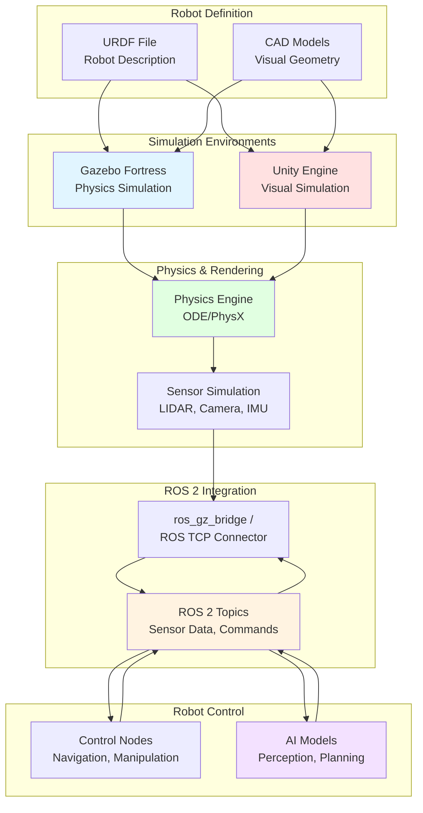

# The Digital Twin (Gazebo & Unity)

## Learning Objectives

By the end of this chapter, you will be able to:

- **Understand** the importance of physics simulation in robotics development and the sim-to-real transfer challenge
- **Set up** and configure Gazebo Fortress for robot simulation with ROS 2 integration
- **Explain** the differences between URDF and SDF (Simulation Description Format) and when to use each
- **Integrate** Unity with ROS 2 for high-fidelity visual simulation and human-robot interaction
- **Compare** Gazebo and Unity simulation platforms to choose the appropriate tool for specific robotics applications
- **Create** simulation environments with accurate physics parameters and sensor models

## Introduction to Physics Simulation

### Why Simulation Matters for Robotics

Physics simulation has become an indispensable tool in modern robotics development. Before deploying robots in the real world, engineers rely on **digital twins**—virtual replicas of physical robots and environments—to test, validate, and refine their systems safely and cost-effectively.

**Key Benefits of Simulation**:

1. **Safety**: Test dangerous scenarios (falling, collisions, extreme conditions) without risking hardware or human safety
2. **Cost-effectiveness**: No hardware damage, reduced prototyping costs, unlimited testing scenarios
3. **Rapid iteration**: Test design changes instantly without manufacturing delays
4. **Scalability**: Run thousands of test scenarios in parallel, explore edge cases systematically
5. **Reproducibility**: Exact scenario replay for debugging and validation
6. **Early development**: Begin software development before hardware is available

For humanoid robots, simulation is particularly valuable because:
- **Balance testing**: Evaluate stability algorithms without expensive falls and repairs
- **Manipulation planning**: Test grasping strategies with thousands of objects
- **Navigation**: Validate path planning in complex environments before real deployment
- **Learning**: Train reinforcement learning policies with millions of interactions

**Simulation Use Cases**:
- Algorithm development and testing (perception, planning, control)
- Training machine learning models (supervised, reinforcement learning)
- System integration testing (sensor fusion, multi-component coordination)
- Performance evaluation (latency, throughput, success rates)
- Safety validation (failure mode analysis, recovery behaviors)

However, simulation is not a perfect substitute for reality. The gap between simulated and real-world performance—the **sim-to-real gap**—remains a fundamental challenge in robotics.

### Sim-to-Real Transfer Challenges

The **sim-to-real gap** refers to the performance degradation that occurs when a robot trained or tested in simulation is deployed in the real world. Several factors contribute to this gap:

**1. Physics Approximations**:
- Simulation engines use simplified physics models (rigid body assumptions, linearized friction)
- Contact dynamics are difficult to model accurately (soft materials, deformation)
- Real-world phenomena like air resistance, material flexibility, and sensor noise are approximated

**2. Sensor Discrepancies**:
- Simulated sensors are often "too perfect" (no noise, no calibration errors)
- Real sensors have bias, drift, failure modes not present in simulation
- Lighting conditions in reality are more complex than simulated lighting

**3. Model Inaccuracies**:
- Robot parameters (mass, inertia, joint friction) may not match reality perfectly
- Actuator dynamics (motor response, backlash, saturation) are simplified
- Environmental interactions (ground compliance, object properties) vary

**4. Computational Differences**:
- Simulated time vs. real-time execution (simulation can be faster or slower)
- Network latency and communication delays differ from simulation
- Computational resources available on real robots may be limited

**Mitigation Strategies**:

**Domain Randomization**: Vary simulation parameters during training to expose the robot to a wide range of conditions:
```python
# Example: Randomize physics parameters
friction_coefficient = random.uniform(0.3, 1.2)
robot_mass = base_mass * random.uniform(0.9, 1.1)
sensor_noise = random.gauss(0, 0.05)
```

**System Identification**: Carefully measure real robot properties and update simulation models:
- Weigh robot components to get accurate mass/inertia
- Measure joint friction and backlash
- Calibrate sensors and characterize noise profiles

**Residual Learning**: Train a correction model that learns the difference between simulation and reality:
- Base policy trained in simulation
- Residual policy learned from real-world data
- Combined policy compensates for sim-to-real gap

**Progressive Deployment**: Start simple, validate incrementally:
1. Validate individual components (sensors, actuators)
2. Test in controlled real-world environments
3. Gradually increase complexity and variability
4. Continuous monitoring and adaptation

Despite these challenges, simulation remains essential. The key is to understand its limitations and use it appropriately as one tool in a comprehensive development process.

## Gazebo Simulation Fundamentals

**Gazebo** (now called **Gazebo Sim**, formerly Ignition Gazebo) is the de facto standard open-source robot simulator for ROS 2. It provides 3D rigid body dynamics simulation with sensor models, actuator simulation, and ROS 2 integration.

### Setting Up Gazebo Fortress

**Gazebo Fortress** is the recommended version for ROS 2 Humble (as of 2025). Note that Gazebo Classic (versions 1-11) reached end-of-life in January 2025, so new projects should use Gazebo Fortress or later.

**Installation on Ubuntu 22.04**:

```bash
# Add Gazebo package repository
sudo apt-get update
sudo apt-get install lsb-release wget gnupg

sudo wget https://packages.osrfoundation.org/gazebo.gpg -O /usr/share/keyrings/pkgs-osrf-archive-keyring.gpg
echo "deb [arch=$(dpkg --print-architecture) signed-by=/usr/share/keyrings/pkgs-osrf-archive-keyring.gpg] http://packages.osrfoundation.org/gazebo/ubuntu-stable $(lsb_release -cs) main" | sudo tee /etc/apt/sources.list.d/gazebo-stable.list > /dev/null

# Install Gazebo Fortress
sudo apt-get update
sudo apt-get install gz-fortress

# Install ROS 2 Gazebo integration packages
sudo apt-get install ros-humble-ros-gz

# Verify installation
gz sim --version
```

**ROS 2 Integration**: The `ros_gz` packages provide bridges between Gazebo topics and ROS 2 topics, enabling seamless communication.

**Key Differences: Gazebo Classic vs. Gazebo Fortress**:

| Feature | Gazebo Classic (11) | Gazebo Fortress |
|---------|---------------------|-----------------|
| **Release Status** | EOL (Jan 2025) | Active development |
| **ROS Version** | ROS 1, ROS 2 (limited) | ROS 2 native |
| **Architecture** | Monolithic | Modular libraries |
| **Performance** | Single-threaded | Multi-threaded |
| **Plugin API** | Legacy | Modern, flexible |
| **Command** | `gazebo` | `gz sim` |

### World Files and Environment Building

Gazebo environments are defined using **SDF (Simulation Description Format)** world files. A world file specifies:
- Models (robots, objects, terrain)
- Environment (lighting, sky, physics)
- Plugins (sensors, controllers, custom behaviors)

**Example Gazebo World File**:

```xml
<?xml version="1.0" ?>
<sdf version="1.8">
  <world name="humanoid_world">

    <!-- Physics configuration -->
    <physics name="1ms" type="ode">
      <max_step_size>0.001</max_step_size>
      <real_time_factor>1.0</real_time_factor>
      <real_time_update_rate>1000.0</real_time_update_rate>
    </physics>

    <!-- Gravity -->
    <gravity>0 0 -9.81</gravity>

    <!-- Atmospheric pressure (for aerodynamics, if needed) -->
    <atmosphere type="adiabatic"/>

    <!-- Scene lighting -->
    <light type="directional" name="sun">
      <cast_shadows>true</cast_shadows>
      <pose>0 0 10 0 0 0</pose>
      <diffuse>0.8 0.8 0.8 1</diffuse>
      <specular>0.2 0.2 0.2 1</specular>
      <attenuation>
        <range>1000</range>
        <constant>0.9</constant>
        <linear>0.01</linear>
        <quadratic>0.001</quadratic>
      </attenuation>
      <direction>-0.5 0.1 -0.9</direction>
    </light>

    <!-- Ground plane -->
    <model name="ground_plane">
      <static>true</static>
      <link name="link">
        <collision name="collision">
          <geometry>
            <plane>
              <normal>0 0 1</normal>
              <size>100 100</size>
            </plane>
          </geometry>
          <surface>
            <friction>
              <ode>
                <mu>1.0</mu>
                <mu2>1.0</mu2>
              </ode>
            </friction>
          </surface>
        </collision>
        <visual name="visual">
          <geometry>
            <plane>
              <normal>0 0 1</normal>
              <size>100 100</size>
            </plane>
          </geometry>
          <material>
            <ambient>0.8 0.8 0.8 1</ambient>
            <diffuse>0.8 0.8 0.8 1</diffuse>
            <specular>0.8 0.8 0.8 1</specular>
          </material>
        </visual>
      </link>
    </model>

    <!-- Add obstacles -->
    <model name="box_obstacle">
      <pose>2 0 0.5 0 0 0</pose>
      <link name="link">
        <collision name="collision">
          <geometry>
            <box>
              <size>0.5 0.5 1.0</size>
            </box>
          </geometry>
        </collision>
        <visual name="visual">
          <geometry>
            <box>
              <size>0.5 0.5 1.0</size>
            </box>
          </geometry>
          <material>
            <ambient>1 0 0 1</ambient>
            <diffuse>1 0 0 1</diffuse>
          </material>
        </visual>
      </link>
    </model>

  </world>
</sdf>
```

**Launching the world**:
```bash
gz sim humanoid_world.sdf
```

### Physics Parameters: Gravity, Friction, Collision

Accurate physics simulation requires careful tuning of parameters. Gazebo supports multiple physics engines:

**Physics Engines**:
- **ODE (Open Dynamics Engine)**: Default, fast, good for most robotics applications
- **Bullet**: Alternative, better for large numbers of objects
- **Simbody**: Higher accuracy, slower, good for biomechanics
- **DART**: Efficient for contact-rich scenarios

**Key Physics Parameters**:

**1. Gravity**: Default is Earth gravity (0, 0, -9.81 m/s²), but can be modified for other planets or testing:
```xml
<gravity>0 0 -9.81</gravity>  <!-- Earth -->
<gravity>0 0 -3.72</gravity>  <!-- Mars -->
<gravity>0 0 0</gravity>      <!-- Microgravity -->
```

**2. Contact Friction**: Controls how surfaces interact. Higher friction = more grip.
```xml
<surface>
  <friction>
    <ode>
      <mu>1.0</mu>    <!-- Primary friction coefficient -->
      <mu2>1.0</mu2>  <!-- Secondary friction (perpendicular) -->
      <slip1>0.0</slip1>
      <slip2>0.0</slip2>
    </ode>
  </friction>
  <contact>
    <ode>
      <kp>1000000.0</kp>  <!-- Contact stiffness (Newtons/meter) -->
      <kd>1.0</kd>         <!-- Contact damping (Newtons*second/meter) -->
    </ode>
  </contact>
</surface>
```

**Typical friction values**:
- Rubber on concrete: μ ≈ 1.0
- Metal on metal: μ ≈ 0.15-0.3
- Ice on ice: μ ≈ 0.02-0.04

**3. Integration Time Step**: Controls simulation accuracy vs. speed trade-off
```xml
<max_step_size>0.001</max_step_size>  <!-- 1ms = 1000 Hz -->
<real_time_factor>1.0</real_time_factor>  <!-- Run at real-time speed -->
```

Smaller time steps = more accurate but slower. For humanoid balance control, 1ms (1000 Hz) is typical.

**4. Solver Iterations**: More iterations = more accurate constraint solving
```xml
<solver>
  <iters>50</iters>  <!-- Increase for complex contact scenarios -->
</solver>
```

### Sensor Simulation (LIDAR, Cameras, IMU)

Gazebo provides plugins to simulate various sensors with realistic noise models.

**LIDAR Sensor Example** (in SDF model):
```xml
<sensor name="lidar" type="gpu_lidar">
  <pose>0 0 0.2 0 0 0</pose>
  <update_rate>10</update_rate>
  <ray>
    <scan>
      <horizontal>
        <samples>640</samples>
        <resolution>1</resolution>
        <min_angle>-2.356</min_angle>  <!-- -135 degrees -->
        <max_angle>2.356</max_angle>   <!-- +135 degrees -->
      </horizontal>
      <vertical>
        <samples>16</samples>
        <resolution>1</resolution>
        <min_angle>-0.261799</min_angle>
        <max_angle>0.261799</max_angle>
      </vertical>
    </scan>
    <range>
      <min>0.1</min>
      <max>30.0</max>
      <resolution>0.01</resolution>
    </range>
    <noise>
      <type>gaussian</type>
      <mean>0.0</mean>
      <stddev>0.01</stddev>
    </noise>
  </ray>
  <plugin name="gz::sim::systems::Sensors" filename="gz-sim-sensors-system"/>
</sensor>
```

**Camera Sensor Example**:
```xml
<sensor name="camera" type="camera">
  <update_rate>30</update_rate>
  <camera>
    <horizontal_fov>1.047</horizontal_fov>  <!-- 60 degrees -->
    <image>
      <width>640</width>
      <height>480</height>
      <format>R8G8B8</format>
    </image>
    <clip>
      <near>0.1</near>
      <far>100</far>
    </clip>
    <noise>
      <type>gaussian</type>
      <mean>0.0</mean>
      <stddev>0.007</stddev>
    </noise>
  </camera>
  <plugin name="gz::sim::systems::Sensors" filename="gz-sim-sensors-system"/>
</sensor>
```

**IMU Sensor Example**:
```xml
<sensor name="imu" type="imu">
  <update_rate>100</update_rate>
  <imu>
    <angular_velocity>
      <x>
        <noise type="gaussian">
          <mean>0.0</mean>
          <stddev>0.01</stddev>
        </noise>
      </x>
      <y>
        <noise type="gaussian">
          <mean>0.0</mean>
          <stddev>0.01</stddev>
        </noise>
      </y>
      <z>
        <noise type="gaussian">
          <mean>0.0</mean>
          <stddev>0.01</stddev>
        </noise>
      </z>
    </angular_velocity>
    <linear_acceleration>
      <x>
        <noise type="gaussian">
          <mean>0.0</mean>
          <stddev>0.1</stddev>
        </noise>
      </x>
      <y>
        <noise type="gaussian">
          <mean>0.0</mean>
          <stddev>0.1</stddev>
        </noise>
      </y>
      <z>
        <noise type="gaussian">
          <mean>0.0</mean>
          <stddev>0.1</stddev>
        </noise>
      </z>
    </linear_acceleration>
  </imu>
  <plugin name="gz::sim::systems::Sensors" filename="gz-sim-sensors-system"/>
</sensor>
```

Sensor data is published to Gazebo topics, which can be bridged to ROS 2 using `ros_gz_bridge`.

## Robot Description Formats

### URDF vs. SDF

Both **URDF (Unified Robot Description Format)** and **SDF (Simulation Description Format)** describe robots, but they have different purposes and capabilities:

| Feature | URDF | SDF |
|---------|------|-----|
| **Purpose** | Single robot description | Complete world description (multiple robots, environment) |
| **Scope** | Robot kinematics, dynamics | Robots + environment + sensors + plugins |
| **Multiple Robots** | No (single robot only) | Yes (can include many models) |
| **Closed Loops** | No | Yes (kinematic loops supported) |
| **Sensors** | Limited | Rich sensor models with noise |
| **Plugins** | ROS-specific | Gazebo-specific |
| **Format** | XML | XML |
| **Compatibility** | ROS 1, ROS 2, MoveIt | Gazebo, Isaac Sim |
| **Conversion** | Can be converted to SDF | Can import URDF |

**When to use URDF**:
- Describing a single robot for ROS 2
- Using MoveIt for motion planning
- Visualizing in RViz
- Sharing robot models across ROS ecosystem

**When to use SDF**:
- Complete simulation environments
- Multiple robots in the same world
- Complex sensor configurations
- Gazebo-specific features (plugins, advanced physics)

**URDF Limitations**:
- No closed kinematic loops (e.g., parallel linkages)
- Limited sensor definitions
- Single robot per file
- No environment description

**SDF Advantages**:
- Fully describe complex worlds
- Advanced sensor models
- Plugin architecture for extensibility
- Supports multiple robots interacting

### Converting Between Formats

Gazebo can automatically convert URDF to SDF, but the reverse is not generally possible (SDF is more expressive).

**Convert URDF to SDF**:
```bash
# Using Gazebo command-line tool
gz sdf -p my_robot.urdf > my_robot.sdf

# Using Python (in ROS 2 package)
from ament_index_python.packages import get_package_share_directory
import xacro
import os

urdf_file = os.path.join(get_package_share_directory('my_package'), 'urdf', 'robot.urdf.xacro')
robot_desc = xacro.process_file(urdf_file).toxml()
# Gazebo will automatically convert URDF to SDF when loading
```

**Including URDF in SDF World**:
```xml
<sdf version="1.8">
  <world name="my_world">
    <include>
      <uri>model://my_robot_urdf</uri>
      <pose>0 0 0.5 0 0 0</pose>
    </include>
  </world>
</sdf>
```

### Best Practices for Simulation Models

Creating accurate simulation models requires attention to physical properties and geometry:

**1. Accurate Mass and Inertia**:
- Weigh real robot components or use CAD models
- Calculate or measure inertia tensors
- Incorrect inertia causes unrealistic dynamics

**Example: Computing inertia for a box**:
```python
import numpy as np

def box_inertia(mass, length, width, height):
    """Compute inertia tensor for a box"""
    ixx = (1/12) * mass * (width**2 + height**2)
    iyy = (1/12) * mass * (length**2 + height**2)
    izz = (1/12) * mass * (length**2 + width**2)
    return np.diag([ixx, iyy, izz])

mass = 2.0  # kg
inertia = box_inertia(mass, 0.3, 0.2, 0.1)
print(f"Inertia tensor:\n{inertia}")
```

**2. Simplified Collision Geometry**:
- Visual geometry can be high-detail meshes
- Collision geometry should be simplified (boxes, cylinders, spheres)
- Simpler collision = faster, more stable simulation

**3. Joint Limits and Damping**:
```xml
<joint name="shoulder_joint" type="revolute">
  <parent>torso</parent>
  <child>upper_arm</child>
  <axis>
    <xyz>0 1 0</xyz>
    <limit>
      <lower>-1.57</lower>  <!-- -90 degrees -->
      <upper>1.57</upper>   <!-- +90 degrees -->
      <effort>10</effort>   <!-- Maximum torque (N*m) -->
      <velocity>2.0</velocity>  <!-- Maximum angular velocity (rad/s) -->
    </limit>
    <dynamics>
      <damping>0.1</damping>  <!-- Joint damping -->
      <friction>0.05</friction>
    </dynamics>
  </axis>
</joint>
```

**4. Material Properties**:
- Set realistic colors and reflectance for visual fidelity
- Configure friction coefficients based on real materials

## Unity for High-Fidelity Robotics

While Gazebo excels at physics simulation, **Unity** offers superior visual fidelity and is particularly well-suited for applications involving human-robot interaction, virtual reality, and photorealistic rendering.

### Unity Robotics Hub Overview

The **Unity Robotics Hub** provides ROS 2 integration for Unity, enabling roboticists to leverage Unity's powerful rendering engine and ecosystem.

**Key Features**:
- **ROS 2 support**: Native communication with ROS 2 via TCP endpoint
- **Photorealistic rendering**: Real-time ray tracing, advanced lighting
- **Physics**: PhysX physics engine (similar to Isaac Sim)
- **AR/VR support**: Build immersive human-robot interaction experiences
- **Asset ecosystem**: Unity Asset Store for environments, models, effects

**Use Cases for Unity in Robotics**:
1. **Human-Robot Interaction (HRI)**: Simulate realistic human avatars and interactions
2. **Synthetic Data Generation**: Train computer vision models with photorealistic labeled images
3. **Telepresence**: VR-based robot control and visualization
4. **User Interface Development**: Build custom control dashboards
5. **Marketing and Visualization**: High-quality renders for presentations

### Setting Up Unity-ROS 2 Integration

**Installation Steps**:

1. **Install Unity Hub and Unity Editor** (2022 LTS recommended):
```bash
# Download Unity Hub from https://unity.com/download
# Install Unity 2022 LTS via Unity Hub
```

2. **Create New Unity Project**:
   - Open Unity Hub → New Project
   - Template: 3D (URP - Universal Render Pipeline for better visuals)
   - Name: `HumanoidRobotSim`

3. **Install Unity Robotics Hub Packages**:
   - Open Unity Package Manager (Window → Package Manager)
   - Add package from git URL:
     - `https://github.com/Unity-Technologies/ROS-TCP-Connector.git?path=/com.unity.robotics.ros-tcp-connector`
     - `https://github.com/Unity-Technologies/URDF-Importer.git?path=/com.unity.robotics.urdf-importer`

4. **Set Up ROS 2 TCP Endpoint** (on ROS 2 machine):
```bash
# Install ROS 2 TCP endpoint
pip install ros-tcp-endpoint

# Run the endpoint (bridges Unity ↔ ROS 2)
ros2 run ros_tcp_endpoint default_server_endpoint
```

5. **Configure Unity ROS Settings**:
   - In Unity: Robotics → ROS Settings
   - Set ROS IP Address (e.g., `192.168.1.100`)
   - Set ROS Port (default: 10000)
   - Protocol: ROS 2

**Example Unity C# Script for ROS 2 Communication**:

```csharp
using UnityEngine;
using Unity.Robotics.ROSTCPConnector;
using RosMessageTypes.Geometry;

public class RobotVelocityController : MonoBehaviour
{
    private ROSConnection ros;
    private string velocityTopicName = "/cmd_vel";

    void Start()
    {
        // Get ROS connection
        ros = ROSConnection.GetOrCreateInstance();
        ros.RegisterPublisher<TwistMsg>(velocityTopicName);
    }

    void Update()
    {
        // Simple keyboard control
        float linearVelocity = 0f;
        float angularVelocity = 0f;

        if (Input.GetKey(KeyCode.W))
            linearVelocity = 0.5f;
        if (Input.GetKey(KeyCode.S))
            linearVelocity = -0.5f;
        if (Input.GetKey(KeyCode.A))
            angularVelocity = 1.0f;
        if (Input.GetKey(KeyCode.D))
            angularVelocity = -1.0f;

        // Create Twist message
        TwistMsg velocityMsg = new TwistMsg();
        velocityMsg.linear = new Vector3Msg(linearVelocity, 0, 0);
        velocityMsg.angular = new Vector3Msg(0, 0, angularVelocity);

        // Publish to ROS 2
        ros.Publish(velocityTopicName, velocityMsg);
    }
}
```

**Subscribing to ROS 2 topics in Unity**:
```csharp
using UnityEngine;
using Unity.Robotics.ROSTCPConnector;
using RosMessageTypes.Sensor;

public class CameraSubscriber : MonoBehaviour
{
    void Start()
    {
        ROSConnection.GetOrCreateInstance().Subscribe<ImageMsg>("/camera/image_raw", UpdateImage);
    }

    void UpdateImage(ImageMsg imageMsg)
    {
        // Process incoming image data
        Debug.Log($"Received image: {imageMsg.width}x{imageMsg.height}");
        // Convert to Unity texture and display...
    }
}
```

### High-Fidelity Rendering and Environments

Unity's rendering capabilities far exceed Gazebo's, making it ideal for applications where visual realism matters.

**Visual Quality Features**:
- **Real-time ray tracing**: Realistic reflections, shadows, global illumination
- **High Dynamic Range (HDR)**: Photorealistic lighting
- **Post-processing**: Motion blur, depth of field, bloom, color grading
- **Particle systems**: Smoke, fire, water effects
- **Advanced materials**: Physically-based rendering (PBR)

**Scene Building**:
- Unity Asset Store: Thousands of pre-built environments, models, effects
- ProBuilder: Built-in 3D modeling tool for rapid prototyping
- Terrain tools: Create outdoor environments with vegetation
- Lighting: Directional lights, point lights, spotlights, area lights

**Performance Considerations**:
- Unity is more resource-intensive than Gazebo
- Physics simulation may be less accurate than dedicated robotics simulators
- Real-time rendering can impact simulation speed
- Recommended: Modern GPU (NVIDIA RTX 3060 or better)

### Human-Robot Interaction in Unity

Unity excels at simulating human-robot interaction scenarios:

**1. Avatar Integration**:
- Import humanoid avatars (Mixamo, Ready Player Me)
- Animate with motion capture or procedural animation
- Simulate human gaze, gestures, speech

**2. VR/AR Interfaces**:
```csharp
using UnityEngine.XR;

public class VRRobotController : MonoBehaviour
{
    void Update()
    {
        // Get VR controller input
        InputDevice rightHand = InputDevices.GetDeviceAtXRNode(XRNode.RightHand);

        if (rightHand.TryGetFeatureValue(CommonUsages.triggerButton, out bool triggerPressed))
        {
            if (triggerPressed)
            {
                // Trigger robot gripper action
                SendGripCommand();
            }
        }
    }

    void SendGripCommand()
    {
        // Publish ROS 2 message to close gripper
        // ...
    }
}
```

**3. Natural Language Interaction**:
- Integrate speech-to-text (Unity Speech API or external services)
- Display conversation bubbles or UI elements
- Synchronize with conversational AI backend

## Choosing the Right Simulation Platform

### Gazebo vs. Unity: Comparison

| Criteria | Gazebo Fortress | Unity |
|----------|-----------------|-------|
| **Rendering Quality** | Moderate (OpenGL) | Excellent (Real-time ray tracing, HDR) |
| **Physics Accuracy** | High (ODE, Bullet, DART) | Moderate (PhysX) |
| **ROS 2 Integration** | Native, seamless | Via TCP bridge (requires endpoint) |
| **Learning Curve** | Moderate (robotics-focused) | Steeper (game engine, broader scope) |
| **Cost** | Free, open-source | Free (Personal), paid (Pro/Enterprise) |
| **Sensor Models** | Comprehensive, realistic noise | Basic, requires custom implementation |
| **Multi-Robot** | Excellent | Good |
| **Performance** | Optimized for robotics | Optimized for real-time rendering |
| **Community** | Robotics-focused | Game development, growing robotics use |
| **AR/VR Support** | Limited | Native, excellent |
| **Documentation** | Good (robotics-specific) | Extensive (general-purpose) |

### Use Cases for Each Platform

**Choose Gazebo if**:
- Focus is on accurate physics simulation (locomotion, manipulation)
- Need native ROS 2 integration without additional middleware
- Developing traditional mobile robots or manipulators
- Require realistic sensor simulation (LIDAR, IMU, cameras with noise)
- Open-source and community-driven tools are priorities

**Choose Unity if**:
- Visual fidelity is critical (demonstrations, HRI, marketing)
- Building AR/VR interfaces for robot control
- Need access to Unity Asset Store ecosystem
- Generating synthetic data for computer vision (photorealistic images)
- Developing user-facing applications with custom UIs

**Hybrid Approach**:
- Develop and test in Gazebo for physics accuracy
- Visualize and present in Unity for stakeholder demos
- Use both: Gazebo for simulation, Unity for visualization (running in parallel)

## Simulation Pipeline Diagram



## Launching Gazebo with ROS 2

**Example Launch File** (Python):

```python
from launch import LaunchDescription
from launch.actions import IncludeLaunchDescription
from launch.launch_description_sources import PythonLaunchDescriptionSource
from launch_ros.actions import Node
from ament_index_python.packages import get_package_share_directory
import os

def generate_launch_description():
    pkg_share = get_package_share_directory('my_robot_description')

    # Paths
    urdf_file = os.path.join(pkg_share, 'urdf', 'robot.urdf')
    world_file = os.path.join(pkg_share, 'worlds', 'humanoid_world.sdf')

    # Read URDF
    with open(urdf_file, 'r') as f:
        robot_desc = f.read()

    return LaunchDescription([
        # Launch Gazebo with specified world
        IncludeLaunchDescription(
            PythonLaunchDescriptionSource([
                os.path.join(get_package_share_directory('ros_gz_sim'), 'launch', 'gz_sim.launch.py')
            ]),
            launch_arguments={'gz_args': f'-r {world_file}'}.items()
        ),

        # Spawn robot in Gazebo
        Node(
            package='ros_gz_sim',
            executable='create',
            arguments=['-name', 'my_robot',
                      '-topic', '/robot_description',
                      '-x', '0', '-y', '0', '-z', '0.5'],
            output='screen'
        ),

        # Robot State Publisher (publishes TF transforms)
        Node(
            package='robot_state_publisher',
            executable='robot_state_publisher',
            parameters=[{'robot_description': robot_desc}],
            output='screen'
        ),

        # Bridge Gazebo topics to ROS 2
        Node(
            package='ros_gz_bridge',
            executable='parameter_bridge',
            arguments=['/scan@sensor_msgs/msg/LaserScan@gz.msgs.LaserScan',
                      '/camera/image_raw@sensor_msgs/msg/Image@gz.msgs.Image',
                      '/imu@sensor_msgs/msg/Imu@gz.msgs.IMU'],
            output='screen'
        ),
    ])
```

**Run the launch file**:
```bash
ros2 launch my_robot_description gazebo_sim.launch.py
```

## Summary

In this chapter, we explored the critical role of physics simulation in robotics development through two major platforms: Gazebo and Unity. Simulation enables safe, cost-effective testing and rapid iteration, though the sim-to-real gap remains a fundamental challenge requiring careful mitigation strategies.

Gazebo Fortress provides accurate physics simulation with native ROS 2 integration, comprehensive sensor models, and a robotics-focused toolset. It is the go-to choice for developing and testing autonomous navigation, manipulation, and control algorithms. Unity, on the other hand, excels in high-fidelity rendering and is ideal for human-robot interaction, AR/VR applications, and synthetic data generation.

Understanding both URDF and SDF formats, configuring realistic physics parameters, and choosing the appropriate simulation platform are essential skills for modern robotics development. These digital twins serve as invaluable testbeds before deploying expensive hardware in the real world.

## Key Takeaways

- **Simulation Value**: Physics simulation enables safe, rapid, and cost-effective robotics development, but the sim-to-real gap requires mitigation through domain randomization, system identification, and careful validation
- **Gazebo Fortress**: Industry-standard open-source simulator with native ROS 2 integration, accurate physics (ODE/Bullet/DART), and comprehensive sensor models
- **SDF vs. URDF**: SDF is more expressive for complete world descriptions with multiple robots; URDF is simpler for single-robot definitions in ROS 2
- **Unity for Robotics**: Excels at photorealistic rendering, AR/VR, and human-robot interaction; requires ROS TCP bridge for ROS 2 communication
- **Platform Selection**: Choose Gazebo for physics-driven applications (navigation, manipulation); choose Unity for visually-driven applications (HRI, demonstrations, synthetic data)
- **Physics Parameters**: Accurate simulation requires careful tuning of gravity, friction, contact dynamics, time step, and sensor noise models
- **Hybrid Workflows**: Combining Gazebo (physics testing) and Unity (visualization) leverages strengths of both platforms

## Further Reading

- **Gazebo Documentation**: https://gazebosim.org/docs/fortress/ — Comprehensive guides, tutorials, and API references
- **SDF Specification**: http://sdformat.org/ — Complete SDF format documentation
- **Unity Robotics Hub**: https://github.com/Unity-Technologies/Unity-Robotics-Hub — ROS 2 integration tutorials and examples
- **ros_gz Packages**: https://github.com/gazebosim/ros_gz — ROS 2-Gazebo integration source code and documentation
- **Sim-to-Real Transfer**: Research papers on domain randomization and transfer learning techniques
- **NVIDIA Omniverse**: Next-generation simulation platform (covered in [Chapter 4](chapter-4.md))

**Cross-Reference**: In [Chapter 2](chapter-2.md), we learned about URDF for robot description and ROS 2 communication. This chapter builds on that foundation by showing how URDF models are used in Gazebo and Unity simulations, and how sensor data flows from simulated environments to ROS 2 nodes for processing and control.
