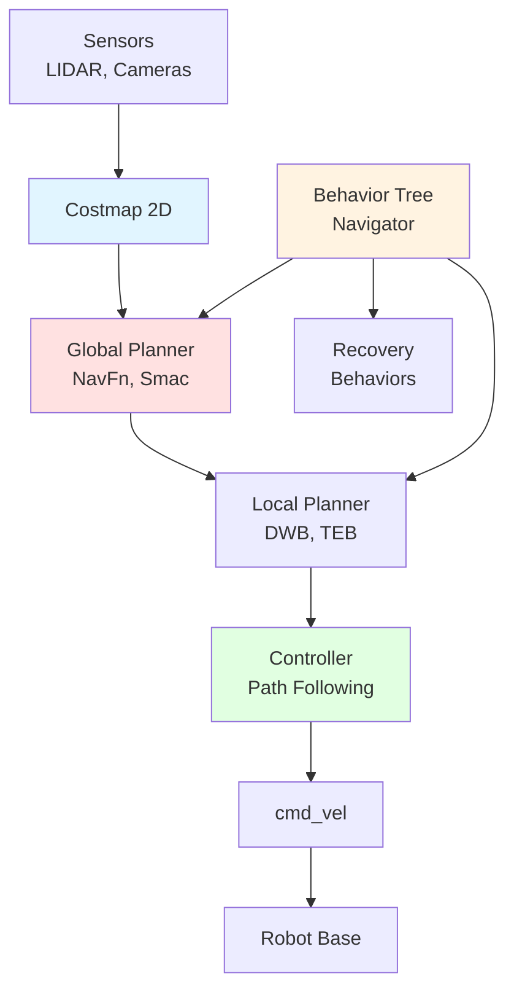

# The AI-Robot Brain (NVIDIA Isaac)

## Learning Objectives

By the end of this chapter, you will be able to:

- **Understand** the NVIDIA Isaac ecosystem (Isaac Sim, Isaac ROS, Isaac Gym) and how these tools integrate to accelerate robotics development
- **Set up** Isaac Sim for photorealistic robot simulation with accurate physics and synthetic data generation
- **Implement** Isaac ROS GPU-accelerated perception pipelines for VSLAM, object detection, and depth processing
- **Configure** Nav2 navigation stack for humanoid path planning and obstacle avoidance
- **Apply** reinforcement learning for robot control using Isaac Gym with massively parallel environments
- **Evaluate** sim-to-real transfer techniques for deploying trained policies on physical robots

## Introduction to NVIDIA Isaac Platform

The **NVIDIA Isaac Platform** represents a paradigm shift in robotics development by leveraging GPU acceleration at every stage: simulation, perception, planning, and learning. Unlike traditional robotics frameworks that rely primarily on CPUs, Isaac harnesses the parallel processing power of GPUs to achieve orders-of-magnitude speedups in critical workflows.

### Isaac Sim: Photorealistic Simulation

**Isaac Sim** is NVIDIA's flagship robotics simulator, built on the **Omniverse** platform. It provides physically accurate, photorealistic simulation environments for developing and testing autonomous robots.

**Key Features**:
- **Ray-traced rendering**: Real-time path tracing using NVIDIA RTX GPUs for photorealistic visuals
- **PhysX 5 physics engine**: GPU-accelerated rigid body dynamics, collision detection, and contact simulation
- **Synthetic data generation**: Automatically annotated images (bounding boxes, segmentation, depth) for training ML models
- **USD (Universal Scene Description)**: Open standard for 3D scene interchange (developed by Pixar)
- **ROS 2 integration**: Native support for ROS 2 Humble and Jazzy
- **Sensor simulation**: Cameras, LIDAR, IMU, contact sensors with configurable noise models

**Why Isaac Sim?**
Traditional simulators like Gazebo prioritize physics accuracy but lag in visual realism. Isaac Sim delivers both—critical for applications where vision-based perception must transfer from simulation to reality. The photorealistic rendering reduces the sim-to-real gap for computer vision models.

**System Requirements**:
- **GPU**: NVIDIA RTX 2070 or higher (RTX 4090 recommended for large scenes)
- **RAM**: 32GB+ recommended
- **Storage**: 50GB+ for Isaac Sim installation
- **OS**: Ubuntu 20.04/22.04 or Windows 10/11

### Isaac ROS: Hardware-Accelerated Perception

**Isaac ROS** is a collection of GPU-accelerated ROS 2 packages that provide state-of-the-art perception capabilities:

**Core Packages**:
- **isaac_ros_visual_slam**: GPU-accelerated stereo visual odometry and SLAM
- **isaac_ros_dnn_inference**: TensorRT-optimized deep learning inference (object detection, segmentation)
- **isaac_ros_image_proc**: Image preprocessing and stereo depth estimation
- **isaac_ros_apriltag**: Fiducial marker detection
- **isaac_ros_nvblox**: 3D scene reconstruction and mapping

**Performance Benefits**:
- **10-20x faster** than CPU-based equivalents
- **Lower latency**: Critical for real-time robot control
- **Power efficiency**: Better performance-per-watt on Jetson platforms

**Compatibility**:
- **Desktop GPUs**: RTX 20/30/40 series
- **Embedded**: Jetson AGX Orin, Xavier, Orin Nano
- **ROS 2**: Humble (LTS), Jazzy (latest)

### The Isaac Ecosystem

The Isaac platform consists of three primary components that work together:

1. **Isaac Sim**: Photorealistic simulation and synthetic data generation
2. **Isaac ROS**: GPU-accelerated perception and navigation
3. **Isaac Gym**: Massively parallel reinforcement learning training

**Workflow Integration**:
```
[Isaac Sim] → Train perception models with synthetic data
     ↓
[Isaac ROS] → Deploy GPU-accelerated inference on robot
     ↓
[Real Robot] → Sim-to-real transfer with domain randomization
```

**Sim-to-Real Workflow**:
1. Develop and test algorithms in Isaac Sim (safe, fast iteration)
2. Train perception/control models using synthetic data or RL (Isaac Gym)
3. Deploy optimized models with Isaac ROS on real hardware
4. Fine-tune with real-world data if needed

## Getting Started with Isaac Sim

### Installation and Setup

**Installation via Omniverse Launcher** (recommended):

```bash
# 1. Download NVIDIA Omniverse Launcher
# https://www.nvidia.com/en-us/omniverse/download/

# 2. Install Omniverse Launcher (Ubuntu):
wget https://install.launcher.omniverse.nvidia.com/installers/omniverse-launcher-linux.AppImage
chmod +x omniverse-launcher-linux.AppImage
./omniverse-launcher-linux.AppImage

# 3. Open Omniverse Launcher → Exchange tab
#    Search for "Isaac Sim" and install (latest: 2023.1.1 or newer)

# 4. Install Isaac Sim Python API (for standalone scripts):
pip install isaacsim

# 5. Set environment variables (add to ~/.bashrc):
export ISAACSIM_PATH=~/.local/share/ov/pkg/isaac_sim-2023.1.1
export PYTHONPATH=$ISAACSIM_PATH/exts/omni.isaac.core:$PYTHONPATH
```

**ROS 2 Integration Setup**:
```bash
# Install ROS 2 Humble (if not already installed)
sudo apt update
sudo apt install ros-humble-desktop

# Install Isaac Sim ROS 2 bridge
cd $ISAACSIM_PATH
./python.sh -m pip install --upgrade pip
./python.sh -m pip install ros2-numpy
```

**Verify Installation**:
```bash
# Launch Isaac Sim GUI
~/.local/share/ov/pkg/isaac_sim-2023.1.1/isaac-sim.sh

# Or run headless (for server environments)
~/.local/share/ov/pkg/isaac_sim-2023.1.1/isaac-sim.headless.native.sh
```

### Importing Robot Models

Isaac Sim supports importing robots from URDF or USD formats. URDF files are automatically converted to USD.

**Example: Isaac Sim Scene Setup with Robot**:

```python
from isaacsim import SimulationApp

# Initialize Isaac Sim (headless mode)
simulation_app = SimulationApp({"headless": False})

from omni.isaac.core import World
from omni.isaac.core.robots import Robot
from omni.isaac.core.utils.stage import add_reference_to_stage
import numpy as np

# Create world
world = World(stage_units_in_meters=1.0)

# Add ground plane
world.scene.add_default_ground_plane()

# Import robot from URDF
robot_usd_path = "/path/to/robot.usd"  # Or use built-in: omniverse://localhost/Isaac/Robots/Franka/franka.usd
robot_prim_path = "/World/robot"

add_reference_to_stage(usd_path=robot_usd_path, prim_path=robot_prim_path)

# Get robot as articulation
from omni.isaac.core.utils.prims import get_prim_at_path
robot = world.scene.add(Robot(prim_path=robot_prim_path, name="my_robot"))

# Reset world
world.reset()

# Simulation loop
for i in range(1000):
    # Step physics (60 Hz = 0.0167s per step)
    world.step(render=True)

    # Apply robot control (example: set joint positions)
    if i % 60 == 0:  # Every second
        joint_positions = np.random.uniform(-0.5, 0.5, robot.num_dof)
        robot.set_joint_positions(joint_positions)

    # Get robot state
    if i % 60 == 0:
        position, orientation = robot.get_world_pose()
        print(f"Robot position: {position}, orientation: {orientation}")

# Clean up
simulation_app.close()
```

**Key Isaac Sim APIs**:
- `World`: Manages the simulation environment
- `Robot`: Represents articulated robots with joints
- `add_reference_to_stage()`: Import USD assets
- `world.step()`: Advance physics simulation
- `get_world_pose()`, `set_joint_positions()`: Robot state and control

### Synthetic Data Generation

One of Isaac Sim's most powerful features is **automated synthetic data generation** for training machine learning models.

**Use Cases**:
- Train object detection models without manual labeling
- Generate diverse scenarios (lighting, poses, occlusions) impossible to capture in reality
- Create perfectly annotated datasets (bounding boxes, segmentation masks, depth)

**Example: Generate Annotated Images**:

```python
from isaacsim import SimulationApp
simulation_app = SimulationApp({"headless": False})

from omni.isaac.core import World
from omni.isaac.synthetic_utils import SyntheticDataHelper
from omni.isaac.core.utils.viewports import set_camera_view
import omni.replicator.core as rep

# Set up world and camera
world = World()
camera = rep.create.camera(position=(2, 2, 1), look_at=(0, 0, 0))

# Enable synthetic data generation
sd_helper = SyntheticDataHelper()
sd_helper.initialize(sensor=camera, sensor_type_rgb=True, sensor_type_depth=True)

# Add objects to scene (with domain randomization)
cube = rep.create.cube(position=(0, 0, 0.5), scale=0.3)

# Domain randomization: vary lighting
with rep.trigger.on_frame(num_frames=100):
    rep.randomizer.light(
        intensity=rep.distribution.uniform(1000, 5000),
        temperature=rep.distribution.uniform(3000, 6500)
    )

# Run and capture data
world.reset()
for frame in range(100):
    world.step(render=True)

    # Get annotated data
    rgb = sd_helper.get_rgb()
    depth = sd_helper.get_depth()
    bbox_2d = sd_helper.get_bounding_box_2d_tight()
    instance_seg = sd_helper.get_instance_segmentation()

    # Save to disk (implement saving logic)
    # save_image(f"rgb_{frame}.png", rgb)
    # save_annotations(f"labels_{frame}.json", bbox_2d)

simulation_app.close()
```

**Replicator**: Isaac Sim includes **Omniverse Replicator**, a powerful tool for generating synthetic datasets with domain randomization (lighting, materials, poses, clutter).

## Isaac ROS: Accelerated Perception

Isaac ROS packages provide drop-in replacements for standard ROS 2 perception nodes, accelerated by NVIDIA GPUs.

### VSLAM (Visual Simultaneous Localization and Mapping)

**Isaac ROS Visual SLAM** provides real-time stereo visual odometry and mapping, crucial for autonomous navigation in GPS-denied environments.

**Installation**:
```bash
sudo apt-get install ros-humble-isaac-ros-visual-slam
```

**Example: Isaac ROS VSLAM Integration**:

```python
# ROS 2 launch file for Isaac ROS Visual SLAM
from launch import LaunchDescription
from launch_ros.actions import Node

def generate_launch_description():
    return LaunchDescription([
        # Isaac ROS Visual SLAM node
        Node(
            package='isaac_ros_visual_slam',
            executable='isaac_ros_visual_slam',
            name='visual_slam',
            parameters=[{
                'enable_rectified_pose': True,
                'denoise_input_images': True,
                'rectified_images': True,
                'enable_debug_mode': False,
                'enable_slam_visualization': True,
                'enable_landmarks_view': True,
                'enable_observations_view': True,
                'map_frame': 'map',
                'odom_frame': 'odom',
                'base_frame': 'base_link',
                'input_camera_frame': 'camera',
            }],
            remappings=[
                ('stereo_camera/left/image', '/camera/left/image_raw'),
                ('stereo_camera/left/camera_info', '/camera/left/camera_info'),
                ('stereo_camera/right/image', '/camera/right/image_raw'),
                ('stereo_camera/right/camera_info', '/camera/right/camera_info'),
                ('visual_slam/tracking/odometry', '/odom'),
            ]
        ),

        # Optional: RViz for visualization
        Node(
            package='rviz2',
            executable='rviz2',
            arguments=['-d', '/path/to/vslam_config.rviz']
        ),
    ])
```

**Performance**: Isaac ROS VSLAM runs at **60+ FPS** on RTX GPUs vs. **5-10 FPS** for CPU-based ORB-SLAM2.

### Object Detection and Segmentation

Isaac ROS provides TensorRT-optimized inference for deep learning models.

**Supported Models**:
- YOLO (YOLOv5, YOLOv8) for object detection
- SegFormer for semantic segmentation
- Custom models (PyTorch/TensorFlow → TensorRT conversion)

**Example Workflow**:
1. Train model in PyTorch
2. Convert to ONNX format
3. Optimize with TensorRT
4. Deploy with Isaac ROS DNN Inference

## Nav2: Path Planning for Humanoids

**Nav2** (Navigation2) is the ROS 2 navigation framework, providing costmap-based path planning, obstacle avoidance, and behavior coordination.

### Introduction to Nav2 Stack

Nav2 consists of several key components:



**Key Components**:
- **Costmap**: Occupancy grid representing obstacles and free space
- **Global Planner**: Computes collision-free path from start to goal
- **Local Planner**: Generates velocity commands to follow the global path
- **Controller**: Executes path-following with dynamic obstacle avoidance
- **Behavior Tree**: Coordinates navigation behaviors (navigate, spin, backup)

### Configuring Nav2 for Bipedal Robots

Humanoid robots require special Nav2 configuration due to their narrow footprint and balance constraints.

**Nav2 Configuration File** (YAML):

```yaml
# nav2_params.yaml
bt_navigator:
  ros__parameters:
    global_frame: map
    robot_base_frame: base_link
    odom_topic: /odom
    bt_loop_duration: 10
    default_server_timeout: 20

controller_server:
  ros__parameters:
    controller_frequency: 20.0
    min_x_velocity_threshold: 0.001
    min_y_velocity_threshold: 0.001
    min_theta_velocity_threshold: 0.001

    # Controller plugin (DWB for differential drive, TEB for humanoid)
    controller_plugins: ["FollowPath"]

    FollowPath:
      plugin: "dwb_core::DWBLocalPlanner"
      # Humanoid-specific settings
      min_vel_x: -0.3  # Slow walking
      max_vel_x: 0.5
      min_vel_y: 0.0   # No lateral motion
      max_vel_y: 0.0
      max_vel_theta: 1.0
      min_speed_xy: 0.0
      max_speed_xy: 0.5
      acc_lim_x: 0.5   # Conservative acceleration
      acc_lim_y: 0.0
      acc_lim_theta: 1.0
      decel_lim_x: -0.5
      decel_lim_y: 0.0
      decel_lim_theta: -1.0

      # Footprint (humanoid is narrow)
      footprint: "[ [0.15, 0.1], [0.15, -0.1], [-0.15, -0.1], [-0.15, 0.1] ]"

      # Trajectory scoring
      path_distance_bias: 32.0
      goal_distance_bias: 24.0
      occdist_scale: 0.01

local_costmap:
  local_costmap:
    ros__parameters:
      update_frequency: 5.0
      publish_frequency: 2.0
      global_frame: odom
      robot_base_frame: base_link
      rolling_window: true
      width: 5
      height: 5
      resolution: 0.05
      robot_radius: 0.2  # Humanoid effective radius

      plugins: ["obstacle_layer", "inflation_layer"]

      obstacle_layer:
        plugin: "nav2_costmap_2d::ObstacleLayer"
        enabled: True
        observation_sources: scan
        scan:
          topic: /scan
          max_obstacle_height: 2.0
          clearing: True
          marking: True
          data_type: "LaserScan"

      inflation_layer:
        plugin: "nav2_costmap_2d::InflationLayer"
        cost_scaling_factor: 3.0
        inflation_radius: 0.5  # Conservative for humanoid stability

global_costmap:
  global_costmap:
    ros__parameters:
      update_frequency: 1.0
      publish_frequency: 1.0
      global_frame: map
      robot_base_frame: base_link
      robot_radius: 0.2
      resolution: 0.05
      track_unknown_space: true

      plugins: ["static_layer", "obstacle_layer", "inflation_layer"]

      static_layer:
        plugin: "nav2_costmap_2d::StaticLayer"
        map_subscribe_transient_local: True

      obstacle_layer:
        plugin: "nav2_costmap_2d::ObstacleLayer"
        enabled: True
        observation_sources: scan
        scan:
          topic: /scan
          max_obstacle_height: 2.0
          clearing: True
          marking: True

      inflation_layer:
        plugin: "nav2_costmap_2d::InflationLayer"
        cost_scaling_factor: 3.0
        inflation_radius: 0.5

planner_server:
  ros__parameters:
    planner_plugins: ["GridBased"]
    GridBased:
      plugin: "nav2_navfn_planner/NavfnPlanner"
      tolerance: 0.5
      use_astar: false  # Dijkstra is more conservative
```

**Launching Nav2**:
```bash
ros2 launch nav2_bringup navigation_launch.py params_file:=/path/to/nav2_params.yaml
```

### Obstacle Avoidance and Dynamic Replanning

Nav2 continuously updates costmaps and replans paths when obstacles are detected.

**Dynamic Obstacle Handling**:
- **Costmap layers**: Combine static map, sensor data, and inflation zones
- **Replanning frequency**: Configured via `controller_frequency` (e.g., 20 Hz)
- **Recovery behaviors**: Backup, spin, wait if path is blocked

**Sending Navigation Goals**:
```python
import rclpy
from rclpy.node import Node
from geometry_msgs.msg import PoseStamped
from nav2_msgs.action import NavigateToPose
from rclpy.action import ActionClient

class Nav2Client(Node):
    def __init__(self):
        super().__init__('nav2_client')
        self.action_client = ActionClient(self, NavigateToPose, 'navigate_to_pose')

    def send_goal(self, x, y, theta):
        goal_msg = NavigateToPose.Goal()
        goal_msg.pose.header.frame_id = 'map'
        goal_msg.pose.header.stamp = self.get_clock().now().to_msg()
        goal_msg.pose.pose.position.x = x
        goal_msg.pose.pose.position.y = y
        goal_msg.pose.pose.orientation.w = 1.0  # Simplified: use quaternion for theta

        self.action_client.wait_for_server()
        self.get_logger().info(f'Sending goal: ({x}, {y}, {theta})')
        future = self.action_client.send_goal_async(goal_msg)
        return future

# Usage
rclpy.init()
client = Nav2Client()
client.send_goal(5.0, 3.0, 0.0)  # Navigate to (5, 3) in map frame
rclpy.spin(client)
```

## Reinforcement Learning for Robot Control

### Isaac Gym: GPU-Accelerated RL

**Isaac Gym** enables training reinforcement learning policies with thousands of parallel environments running on a single GPU.

**Key Features**:
- **Massively parallel**: 4000+ environments on RTX 4090
- **GPU physics**: PhysX simulation runs entirely on GPU
- **Fast training**: 10-100x faster than CPU-based alternatives
- **PPO, SAC, etc.**: Integrated RL algorithms

**Installation**:
```bash
pip install isaacgym
```

### Training Locomotion Policies

**Example: Humanoid Locomotion RL**:

```python
from isaacgym import gymapi
from isaacgym import gymutil
import torch
import numpy as np

# Initialize Isaac Gym
gym = gymapi.acquire_gym()

# Create simulation
sim_params = gymapi.SimParams()
sim_params.dt = 1.0 / 60.0
sim_params.gravity = gymapi.Vec3(0.0, 0.0, -9.81)
sim_params.up_axis = gymapi.UP_AXIS_Z

sim = gym.create_sim(0, 0, gymapi.SIM_PHYSX, sim_params)

# Create ground plane
plane_params = gymapi.PlaneParams()
plane_params.normal = gymapi.Vec3(0, 0, 1)
gym.add_ground(sim, plane_params)

# Load humanoid asset
asset_root = "assets"
asset_file = "humanoid.urdf"
asset = gym.load_asset(sim, asset_root, asset_file)

# Create environments (parallel)
num_envs = 256
envs = []
actors = []

for i in range(num_envs):
    env = gym.create_env(sim, gymapi.Vec3(-2, -2, 0), gymapi.Vec3(2, 2, 2), 8)
    pose = gymapi.Transform()
    pose.p = gymapi.Vec3(0, 0, 1.0)
    actor = gym.create_actor(env, asset, pose, f"humanoid_{i}", i, 1)
    envs.append(env)
    actors.append(actor)

# RL Training Loop
num_iterations = 10000
for iteration in range(num_iterations):
    # Step simulation
    gym.simulate(sim)
    gym.fetch_results(sim, True)

    # Get observations (joint positions, velocities, etc.)
    observations = get_observations(gym, envs, actors)  # Implement this

    # RL Policy: Select actions
    actions = policy_network(observations)  # PyTorch neural network

    # Apply actions (joint torques)
    for i, env in enumerate(envs):
        gym.set_dof_actuation_force_tensor(sim, actors[i], actions[i])

    # Compute rewards
    rewards = compute_rewards(gym, envs, actors)  # Implement reward function

    # Update policy (PPO, SAC, etc.)
    policy_network.update(observations, actions, rewards)

    # Render (optional, slows training)
    if iteration % 100 == 0:
        gym.step_graphics(sim)
        gym.draw_viewer(viewer, sim, True)

# Save trained policy
torch.save(policy_network.state_dict(), "humanoid_policy.pth")
```

**Reward Function Design** (critical for RL success):
```python
def compute_rewards(gym, envs, actors):
    rewards = []
    for i, env in enumerate(envs):
        # Get robot state
        pos = gym.get_actor_rigid_body_states(env, actors[i], gymapi.STATE_POS)
        vel = gym.get_actor_rigid_body_states(env, actors[i], gymapi.STATE_VEL)

        # Reward components
        forward_velocity = vel.linear.x
        upright_bonus = 1.0 if pos.z > 0.8 else 0.0  # Stay standing
        energy_penalty = -0.01 * sum(torques ** 2)  # Minimize energy

        total_reward = forward_velocity + upright_bonus + energy_penalty
        rewards.append(total_reward)

    return torch.tensor(rewards)
```

### Sim-to-Real Transfer Techniques

Deploying RL policies trained in simulation to real robots requires careful sim-to-real transfer:

**Domain Randomization**:
```python
# Randomize physics parameters during training
for env in envs:
    friction = np.random.uniform(0.5, 1.5)
    mass_scale = np.random.uniform(0.9, 1.1)
    gym.set_actor_friction(env, actor, friction)
    gym.set_actor_mass_scale(env, actor, mass_scale)
```

**System Identification**: Measure real robot parameters and update simulation to match reality.

**Residual Learning**: Train a small correction network on real-world data to compensate for sim-to-real gap.

## Summary

In this chapter, we explored the NVIDIA Isaac Platform—a comprehensive GPU-accelerated ecosystem for robotics development. Isaac Sim provides photorealistic simulation with accurate physics, enabling safe algorithm development and synthetic data generation. Isaac ROS delivers hardware-accelerated perception pipelines that run 10-20x faster than CPU equivalents, crucial for real-time robot control. Isaac Gym enables massively parallel reinforcement learning, training locomotion policies with thousands of environments simultaneously.

We also covered Nav2, the ROS 2 navigation framework, and learned how to configure it for humanoid robots with narrow footprints and balance constraints. Together, these tools form a powerful "AI-robot brain" capable of perception, planning, and learning—essential capabilities for autonomous humanoid systems.

## Key Takeaways

- **Isaac Platform**: Comprehensive GPU-accelerated ecosystem (Sim + ROS + Gym) for simulation, perception, and learning
- **Isaac Sim**: Photorealistic simulation with PhysX 5 physics, synthetic data generation, and ROS 2 integration for training vision models
- **Isaac ROS**: GPU-accelerated perception pipelines (VSLAM, object detection, depth processing) with 10-20x CPU speedup
- **Nav2 Stack**: ROS 2 navigation framework with behavior trees, global/local planners, and dynamic obstacle avoidance
- **Humanoid Navigation**: Requires careful footprint configuration, conservative acceleration limits, and stability-aware planning
- **Isaac Gym**: Massively parallel RL training (4000+ environments on single GPU) for learning locomotion and manipulation policies
- **Sim-to-Real Transfer**: Critical challenge requiring domain randomization, system identification, and residual learning for deployment

## Further Reading

- **Isaac Sim Documentation**: https://docs.isaacsim.omniverse.nvidia.com/ — Complete guides, tutorials, and API references
- **Isaac ROS**: https://nvidia-isaac-ros.github.io/ — GPU-accelerated ROS 2 packages and performance benchmarks
- **Nav2 Documentation**: https://navigation.ros.org/ — Navigation stack tutorials and configuration guides
- **Isaac Gym**: https://developer.nvidia.com/isaac-gym — Reinforcement learning platform documentation
- **Omniverse Replicator**: https://docs.omniverse.nvidia.com/replicator/ — Synthetic data generation toolkit
- **PhysX 5**: https://developer.nvidia.com/physx-sdk — Physics engine documentation
- **ROS 2 Humble**: https://docs.ros.org/en/humble/ — Core ROS 2 documentation

**Cross-Reference**: In [Chapter 3](chapter-3.md), we learned about Gazebo and Unity for robot simulation. This chapter builds on that foundation by introducing NVIDIA Isaac Sim, which combines Gazebo's physics accuracy with Unity's visual fidelity—plus GPU acceleration for perception and learning. The ROS 2 skills from [Chapter 2](chapter-2.md) are essential for integrating Isaac ROS packages into your robot's software stack.
