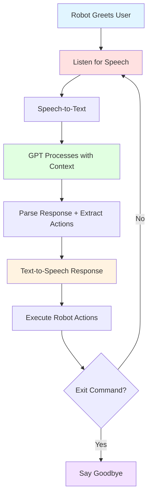

# Conversational Robotics

## Learning Objectives

By the end of this chapter, you will be able to:

- **Understand** the role of conversational AI in natural human-robot interaction and its impact on robot usability
- **Integrate** GPT models (GPT-4, GPT-3.5) for context-aware conversational agents in robotic systems
- **Implement** speech-to-text and text-to-speech systems for bi-directional voice communication
- **Design** multi-modal interaction systems that combine speech, gesture, and visual cues
- **Build** a complete conversational humanoid robot with context management and state tracking
- **Evaluate** conversation quality metrics and strategies for handling dialogue failures

## Introduction to Conversational AI for Robots

### Why Conversation Matters

Humans communicate primarily through conversation—it's our most natural interface. For robots to truly integrate into human environments (homes, offices, hospitals), they must engage in fluent, natural dialogue. **Conversational robotics** transforms robots from tools operated by experts into assistants accessible to everyone.

**Traditional Robot Interaction**:
- Specialized interfaces (joysticks, keyboards, programming)
- Command-line or GUI control
- Requires technical expertise
- Limited to pre-programmed commands

**Conversational Robot Interaction**:
- Natural language dialogue
- Context-aware responses
- Accessible to non-experts (children, elderly)
- Flexible, adaptable communication

**Benefits of Conversational Interfaces**:
1. **Accessibility**: Anyone can interact without training
2. **Efficiency**: Speak faster than type
3. **Hands-free**: No physical interface required
4. **Social presence**: Conversation creates engagement and trust
5. **Error recovery**: Dialogue enables clarification and correction

**Applications**:
- **Eldercare**: Companionship, medication reminders, emergency assistance
- **Education**: Tutoring, language learning, STEM demonstrations
- **Healthcare**: Patient monitoring, therapy support, rehabilitation
- **Service**: Reception, guidance, customer service
- **Home assistance**: Cooking help, cleaning coordination, entertainment

### Natural Human-Robot Interaction (HRI)

Effective conversational robotics requires understanding **human-robot interaction** principles:

**HRI Challenges**:
- **Ambiguity**: Natural language is inherently ambiguous ("it" refers to what?)
- **Context**: Understanding requires tracking conversation history
- **Non-verbal cues**: Humans use gestures, gaze, tone—robots must interpret these
- **Interruptions**: Handle multi-party conversations, background noise
- **Turn-taking**: Know when to speak, when to listen
- **Expectations**: Humans expect human-like understanding, but robots have limitations

**Design Principles for Conversational Robots**:
1. **Transparency**: Be clear about capabilities and limitations
2. **Feedback**: Acknowledge commands, indicate processing state
3. **Error handling**: Gracefully recover from misunderstandings
4. **Personality**: Consistent tone and character builds trust
5. **Privacy**: Respect user data, provide control over recordings

## Integrating GPT Models

### Setting Up GPT API

**OpenAI GPT Models** (as of 2025):
- **GPT-4**: Most capable, best for complex reasoning and context
- **GPT-3.5-turbo**: Fast, cost-effective, good for most conversations
- **GPT-4-turbo**: Balance of capability and speed

**Installation and Setup**:

```python
# Install OpenAI Python library
pip install openai

# Set API key (environment variable recommended)
import os
os.environ['OPENAI_API_KEY'] = 'your-api-key-here'
```

**Basic Conversation Example**:

```python
import openai
import os

openai.api_key = os.getenv('OPENAI_API_KEY')

def chat_with_gpt(messages, model='gpt-3.5-turbo'):
    """
    Send messages to GPT and get response

    Args:
        messages: List of message dicts with 'role' and 'content'
        model: GPT model to use

    Returns:
        Assistant's response text
    """
    response = openai.ChatCompletion.create(
        model=model,
        messages=messages,
        temperature=0.7,  # 0 = deterministic, 1 = creative
        max_tokens=150,
        top_p=1.0,
        frequency_penalty=0.0,
        presence_penalty=0.0
    )

    return response['choices'][0]['message']['content']

# Example conversation
messages = [
    {"role": "system", "content": "You are a helpful robot assistant named Robo."},
    {"role": "user", "content": "Hello! What can you do?"}
]

response = chat_with_gpt(messages)
print(f"Robo: {response}")
```

### Designing Conversational Context

The key to natural conversation is **context management**—remembering what has been said and maintaining coherent dialogue.

**Conversation State**:
- **History**: Track all previous messages
- **User profile**: Remember user preferences, name, facts
- **Task state**: Track current task progress (e.g., recipe step 3/10)
- **Environment state**: Robot location, battery, sensor data

**Context-Aware Conversational Agent**:

```python
import rclpy
from rclpy.node import Node
import openai
import json

class ConversationalRobotAgent(Node):
    """
    GPT-powered conversational agent with context management
    """
    def __init__(self):
        super().__init__('conversational_agent')

        # Conversation history
        self.conversation_history = []

        # User profile
        self.user_profile = {
            'name': None,
            'preferences': {},
            'interaction_count': 0
        }

        # Robot state
        self.robot_state = {
            'location': 'living_room',
            'battery': 85,
            'current_task': None
        }

        # System prompt defines robot personality and capabilities
        self.system_prompt = """You are Robo, a friendly humanoid robot assistant. You can:
- Navigate to different rooms (kitchen, bedroom, living room)
- Pick up and move objects
- Answer questions and provide information
- Play music and set reminders

Personality: Helpful, patient, slightly humorous. Keep responses concise (2-3 sentences max).
Always acknowledge the user's request and provide clear next steps.
If you cannot do something, be honest and suggest alternatives."""

        # Initialize conversation with system prompt
        self.conversation_history.append({
            "role": "system",
            "content": self.system_prompt
        })

        self.get_logger().info("Conversational Agent initialized")

    def update_robot_state(self, key, value):
        """Update robot state (location, battery, etc.)"""
        self.robot_state[key] = value
        self.get_logger().info(f"Robot state updated: {key} = {value}")

    def add_user_message(self, message):
        """Add user message to conversation history"""
        self.conversation_history.append({
            "role": "user",
            "content": message
        })
        self.user_profile['interaction_count'] += 1

    def add_assistant_message(self, message):
        """Add assistant (robot) response to history"""
        self.conversation_history.append({
            "role": "assistant",
            "content": message
        })

    def get_response(self, user_input):
        """
        Generate context-aware response using GPT

        Args:
            user_input: User's spoken or typed message

        Returns:
            Robot's response text
        """
        # Add context about robot state
        context_msg = f"""Current robot status:
- Location: {self.robot_state['location']}
- Battery: {self.robot_state['battery']}%
- Current task: {self.robot_state['current_task'] or 'None'}
"""

        # Inject context before user message
        context_aware_history = self.conversation_history.copy()
        context_aware_history.append({
            "role": "system",
            "content": context_msg
        })
        context_aware_history.append({
            "role": "user",
            "content": user_input
        })

        # Get GPT response
        response = openai.ChatCompletion.create(
            model="gpt-3.5-turbo",
            messages=context_aware_history,
            temperature=0.7,
            max_tokens=150
        )

        assistant_message = response['choices'][0]['message']['content']

        # Update conversation history (without context injection)
        self.add_user_message(user_input)
        self.add_assistant_message(assistant_message)

        return assistant_message

    def handle_conversation_turn(self, user_input):
        """
        Process one turn of conversation

        Returns:
            dict with response text and any actions to execute
        """
        response_text = self.get_response(user_input)

        # Parse response for actions (simplified - could use function calling)
        actions = self.extract_actions(response_text)

        return {
            'text': response_text,
            'actions': actions
        }

    def extract_actions(self, response_text):
        """
        Extract robot actions from GPT response
        (In practice, use GPT function calling for structured output)
        """
        actions = []

        # Simple keyword matching (replace with function calling in production)
        if 'navigate' in response_text.lower() or 'go to' in response_text.lower():
            # Extract location (would parse more carefully)
            for room in ['kitchen', 'bedroom', 'living_room']:
                if room in response_text.lower():
                    actions.append({'type': 'navigate', 'location': room})

        if 'pick up' in response_text.lower():
            actions.append({'type': 'pick', 'object': 'unknown'})  # Would parse object

        return actions

# Usage example
def main():
    rclpy.init()
    agent = ConversationalRobotAgent()

    # Simulate conversation
    conversation = [
        "Hi, my name is Alice.",
        "Can you go to the kitchen?",
        "What's your battery level?",
        "Pick up the cup and bring it here."
    ]

    for user_input in conversation:
        print(f"\nUser: {user_input}")

        result = agent.handle_conversation_turn(user_input)

        print(f"Robo: {result['text']}")

        if result['actions']:
            print(f"Actions to execute: {result['actions']}")

    agent.destroy_node()
    rclpy.shutdown()

if __name__ == '__main__':
    main()
```

### Managing Conversation State

For long conversations, we need to manage context window limits (GPT-3.5: 4K tokens, GPT-4: 8K-128K tokens):

**Strategies**:
1. **Sliding window**: Keep only last N messages
2. **Summarization**: Periodically summarize old conversation
3. **Importance filtering**: Keep important facts, discard small talk
4. **Memory database**: Store long-term facts separately

**Conversation Memory with Summarization**:

```python
def summarize_conversation(self):
    """Compress old conversation history into summary"""
    if len(self.conversation_history) > 20:  # Threshold
        # Extract old messages (except system prompt)
        old_messages = self.conversation_history[1:15]  # Messages 1-14

        # Create summary request
        summary_request = [{
            "role": "system",
            "content": "Summarize the following conversation in 2-3 sentences, preserving key facts and user preferences."
        }]

        for msg in old_messages:
            summary_request.append(msg)

        # Get summary
        response = openai.ChatCompletion.create(
            model="gpt-3.5-turbo",
            messages=summary_request,
            temperature=0.3,
            max_tokens=100
        )

        summary = response['choices'][0]['message']['content']

        # Replace old messages with summary
        self.conversation_history = [
            self.conversation_history[0],  # Keep system prompt
            {"role": "assistant", "content": f"[Conversation summary: {summary}]"}
        ] + self.conversation_history[15:]  # Keep recent messages

        self.get_logger().info(f"Conversation summarized: {summary}")
```

## Speech Recognition and Synthesis

### Speech-to-Text Integration

We covered Whisper in [Chapter 5](chapter-5.md). For conversational robotics, we need **streaming** speech recognition for real-time interaction.

**Alternative: Google Speech-to-Text** (for streaming):

```python
from google.cloud import speech
import pyaudio

class StreamingRecognizer:
    """Real-time speech recognition using Google Cloud Speech"""

    def __init__(self):
        self.client = speech.SpeechClient()

        # Audio recording parameters
        self.rate = 16000
        self.chunk = int(self.rate / 10)  # 100ms chunks

    def listen_print_loop(self, responses):
        """
        Process streaming responses and return final transcript
        """
        for response in responses:
            if not response.results:
                continue

            result = response.results[0]

            if not result.alternatives:
                continue

            transcript = result.alternatives[0].transcript

            # Return transcript when speech is complete
            if result.is_final:
                return transcript

        return None

    def recognize_streaming(self):
        """Perform streaming speech recognition"""

        config = speech.RecognitionConfig(
            encoding=speech.RecognitionConfig.AudioEncoding.LINEAR16,
            sample_rate_hertz=self.rate,
            language_code="en-US",
        )

        streaming_config = speech.StreamingRecognitionConfig(
            config=config, interim_results=True
        )

        # Audio stream
        audio_interface = pyaudio.PyAudio()
        stream = audio_interface.open(
            format=pyaudio.paInt16,
            channels=1,
            rate=self.rate,
            input=True,
            frames_per_buffer=self.chunk,
        )

        def audio_generator():
            while True:
                data = stream.read(self.chunk)
                yield speech.StreamingRecognizeRequest(audio_content=data)

        requests = audio_generator()
        responses = self.client.streaming_recognize(streaming_config, requests)

        transcript = self.listen_print_loop(responses)

        stream.stop_stream()
        stream.close()
        audio_interface.terminate()

        return transcript
```

### Text-to-Speech (TTS)

**Options for TTS**:
- **gTTS (Google Text-to-Speech)**: Free, simple, moderate quality
- **Coqui TTS**: Open-source, high-quality, local inference
- **Amazon Polly**: Cloud-based, many voices, good quality
- **ElevenLabs**: State-of-the-art, very natural voices (paid)

**Example: gTTS Integration**:

```python
from gtts import gTTS
import pygame
import tempfile
import os

class TextToSpeech:
    """
    Text-to-speech using gTTS and pygame for playback
    """
    def __init__(self, language='en', slow=False):
        self.language = language
        self.slow = slow

        # Initialize pygame mixer for audio playback
        pygame.mixer.init()

    def speak(self, text):
        """
        Convert text to speech and play audio

        Args:
            text: String to speak
        """
        print(f"[TTS] Speaking: {text}")

        # Generate speech
        tts = gTTS(text=text, lang=self.language, slow=self.slow)

        # Save to temporary file
        with tempfile.NamedTemporaryFile(delete=False, suffix='.mp3') as fp:
            tts.save(fp.name)
            temp_file = fp.name

        # Play audio
        pygame.mixer.music.load(temp_file)
        pygame.mixer.music.play()

        # Wait for playback to finish
        while pygame.mixer.music.get_busy():
            pygame.time.Clock().tick(10)

        # Clean up
        os.remove(temp_file)

# Usage
tts = TextToSpeech()
tts.speak("Hello! I am Robo, your friendly robot assistant. How can I help you today?")
```

**For higher quality, use Coqui TTS** (local, neural TTS):

```python
from TTS.api import TTS

class CoquiTTS:
    def __init__(self, model_name='tts_models/en/ljspeech/tacotron2-DDC'):
        self.tts = TTS(model_name=model_name)

    def speak(self, text, output_path='output.wav'):
        """Generate speech and save to file"""
        self.tts.tts_to_file(text=text, file_path=output_path)
        # Then play with pygame or other audio library
```

## Multi-Modal Interaction

Conversations aren't just words—humans use gestures, facial expressions, and gaze. Robots should leverage all available modalities.

### Combining Speech, Gesture, and Vision

**Multi-Modal Intent Recognition**:

```python
class MultiModalIntentRecognizer(Node):
    """
    Combine speech, gesture, and visual cues for intent recognition
    """
    def __init__(self):
        super().__init__('multimodal_intent')

        # Speech recognition
        self.speech_recognizer = StreamingRecognizer()

        # Gesture recognition (placeholder - would use pose estimation)
        self.gesture_detector = GestureDetector()

        # Vision for object detection
        self.object_detector = ObjectDetector()

        # Subscribe to camera
        self.create_subscription(Image, '/camera/rgb/image_raw', self.image_callback, 10)

        self.latest_image = None

    def image_callback(self, msg):
        self.latest_image = self.bridge.imgmsg_to_cv2(msg, 'bgr8')

    def recognize_multimodal_command(self):
        """
        Combine speech + gesture + vision for robust command understanding
        """
        # Get speech input
        speech_text = self.speech_recognizer.recognize_streaming()

        # Detect pointing gesture
        gesture = self.gesture_detector.detect_pointing(self.latest_image)

        # Detect objects in pointed direction
        if gesture and gesture['type'] == 'pointing':
            pointed_object = self.object_detector.detect_at_point(
                self.latest_image,
                gesture['direction']
            )

            # Resolve ambiguous references
            if "that" in speech_text or "this" in speech_text:
                # Replace with specific object
                speech_text = speech_text.replace("that", pointed_object)
                speech_text = speech_text.replace("this", pointed_object)

        return {
            'command': speech_text,
            'gesture': gesture,
            'visual_context': {'objects': self.object_detector.get_all_objects()}
        }
```

**Example Scenario**:
- User says: "Pick up **that**" (points at cup)
- Robot sees: Cup, bottle, book
- Gesture detector: User pointing at 30° right
- Vision system: Cup is at 30° right
- Intent: "Pick up cup"

## Building a Conversational Humanoid

Putting it all together into a complete conversational robot:

```python
import rclpy
from rclpy.node import Node

class ConversationalHumanoid(Node):
    """
    Complete conversational robot integrating all components
    """
    def __init__(self):
        super().__init__('conversational_humanoid')

        # Components
        self.conversation_agent = ConversationalRobotAgent()
        self.tts = TextToSpeech()
        self.stt = StreamingRecognizer()  # or WhisperVoiceInput
        self.action_executor = RobotActionExecutor()

        # State
        self.is_listening = False
        self.conversation_active = True

        self.get_logger().info("Conversational Humanoid ready")

    def run_conversation_loop(self):
        """
        Main conversation loop
        """
        # Greeting
        greeting = "Hello! I'm Robo, your assistant. How can I help you today?"
        self.tts.speak(greeting)
        self.conversation_agent.add_assistant_message(greeting)

        while rclpy.ok() and self.conversation_active:
            try:
                # Listen for user input
                self.get_logger().info("Listening...")
                self.is_listening = True

                user_input = self.stt.recognize_streaming()

                self.is_listening = False

                if not user_input:
                    continue

                self.get_logger().info(f"Heard: {user_input}")

                # Check for exit command
                if "goodbye" in user_input.lower() or "stop" in user_input.lower():
                    farewell = "Goodbye! It was nice talking with you."
                    self.tts.speak(farewell)
                    self.conversation_active = False
                    break

                # Get conversational response
                result = self.conversation_agent.handle_conversation_turn(user_input)

                # Speak response
                self.tts.speak(result['text'])

                # Execute any actions
                for action in result['actions']:
                    self.get_logger().info(f"Executing action: {action}")
                    self.action_executor.execute_action(action)

            except KeyboardInterrupt:
                break
            except Exception as e:
                self.get_logger().error(f"Error in conversation loop: {e}")
                error_msg = "Sorry, I didn't quite understand that. Could you rephrase?"
                self.tts.speak(error_msg)

def main():
    rclpy.init()
    robot = ConversationalHumanoid()
    robot.run_conversation_loop()
    robot.destroy_node()
    rclpy.shutdown()

if __name__ == '__main__':
    main()
```

**Conversation Flow Diagram**:



## Summary

In this chapter, we explored conversational robotics—the integration of speech recognition, natural language understanding, and text-to-speech to enable fluent human-robot dialogue. We implemented GPT-powered conversational agents with context management, integrated speech-to-text (Whisper, Google Speech) and text-to-speech (gTTS, Coqui) systems, and designed multi-modal interaction frameworks that combine speech, gesture, and vision.

A complete conversational humanoid robot brings together all these components into a natural, accessible interface that makes robotics technology usable by everyone, from children to the elderly. Effective conversation transforms robots from tools into assistants and companions.

## Key Takeaways

- **Natural Interaction**: Conversational interfaces make robots accessible to non-experts through the most natural human communication method
- **GPT Integration**: Large language models provide context-aware, intelligent dialogue capabilities with personality and reasoning
- **Context Management**: Maintaining conversation history, user profiles, and robot state enables coherent, personalized interactions
- **Speech Systems**: Combining speech-to-text (Whisper, Google) and text-to-speech (gTTS, Coqui) enables bi-directional voice communication
- **Multi-Modal Intent**: Fusing speech, gesture, and vision resolves ambiguities and enables natural referring expressions ("that cup")
- **Complete Pipeline**: Listen → Understand → Respond → Act creates the conversation-action loop for embodied conversational agents
- **Design Principles**: Transparency about capabilities, graceful error handling, and consistent personality build trust and usability

## Further Reading

- **OpenAI Chat Completions API**: https://platform.openai.com/docs/guides/chat — GPT API documentation and best practices
- **Whisper**: https://github.com/openai/whisper — OpenAI's speech recognition model
- **gTTS Documentation**: https://gtts.readthedocs.io/ — Google Text-to-Speech Python library
- **Coqui TTS**: https://github.com/coqui-ai/TTS — Open-source neural text-to-speech
- **Human-Robot Interaction**: "The Design of Everyday Things" by Don Norman — HCI principles applicable to robotics
- **Conversation Design**: Google's Conversation Design guidelines for voice assistants

**Cross-Reference**: In [Chapter 5](chapter-5.md), we built a VLA pipeline for voice-to-action translation. This chapter extends that foundation with full conversational capabilities, context management, and bi-directional dialogue. The ROS 2 integration from [Chapter 2](chapter-2.md) enables executing actions generated from conversation, creating a complete embodied conversational agent.
